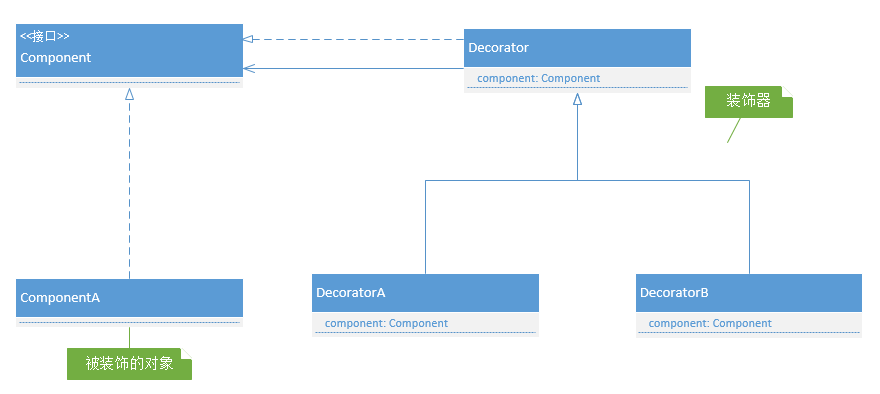

装饰器模式中主要有两个角色：
- 装饰器；
- 被装饰的对象。

装饰器和被装饰的对象有两个特点，也是装饰器模式的关键：
- 他们实现同一个接口；
- 装饰器中使用了被装饰的对象。

使用装饰器模式的几个关键点：
- 装饰器和被装饰类要实现同一个接口（ 实际开发中也可能用继承 ）。
- 装饰器中的方法可以调用被装饰对象提供的方法，以此实现功能累加的效果，例如，夹克装饰器和帽子装饰器中调用了 person.cost() + xx 实现累计消费金额的累加。

