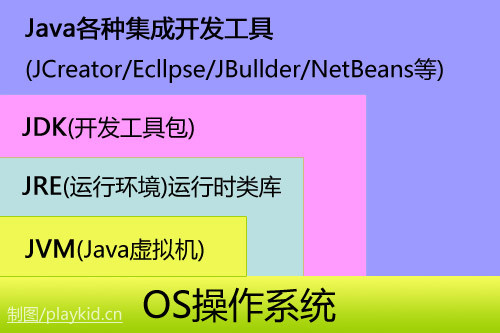
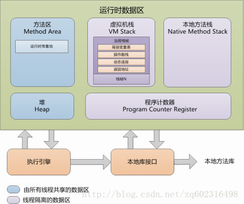
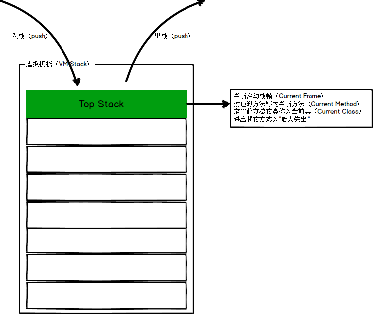
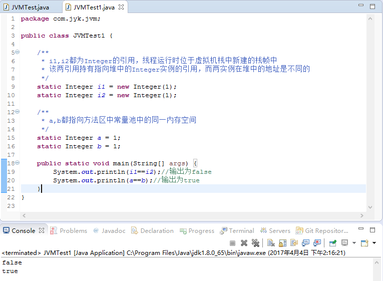
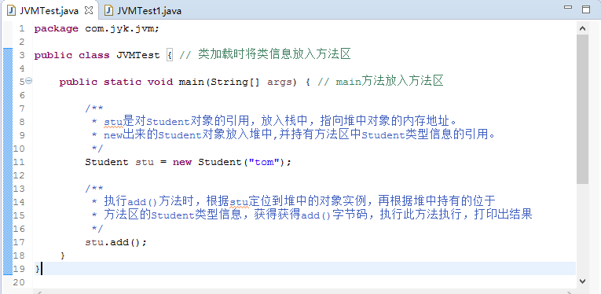
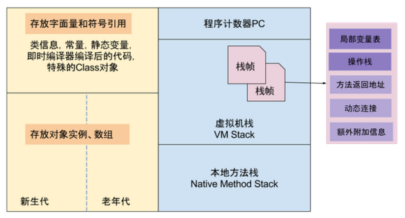
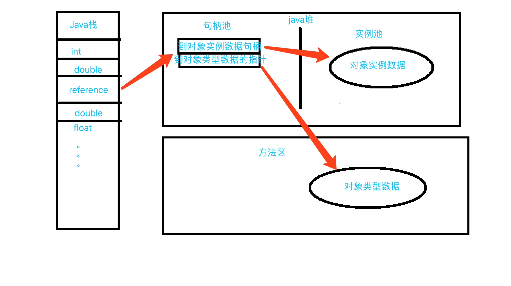
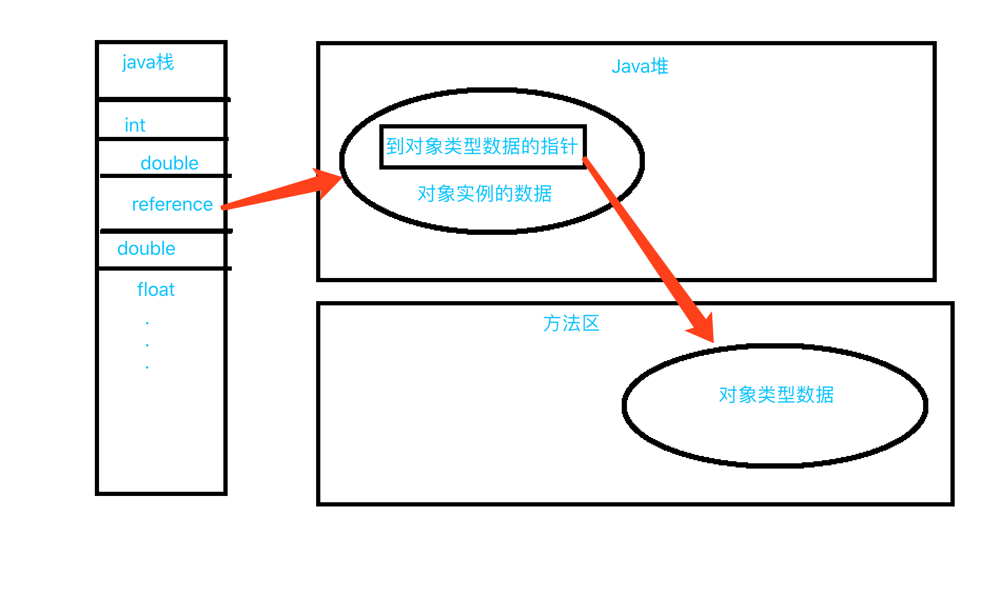

### 1.JDK、JRE、JVM三者间的关系

#### JDK（Java Development Kit）
JDK是Java开发工具包，JDK中包含JRE，在JDK的安装目录下有一个名为jre的目录，里面有两个文件夹bin和lib，在这里可以认为bin里的就是jvm，lib中则是jvm工作所需要的类库，而jvm和 lib和起来就称为jre。\
JDK是整个JAVA的核心，包括了Java运行环境JRE（Java Runtime Envirnment）、一堆Java工具（javac/java/jdb等）和Java基础的类库（即Java API 包括rt.jar）。\
①SE(J2SE)，standard edition，标准版，是我们通常用的一个版本，从JDK 5.0开始，改名为Java SE。\
②EE(J2EE)，enterprise edition，企业版，使用这种JDK开发J2EE应用程序，从JDK 5.0开始，改名为Java EE。\
③ME(J2ME)，micro edition，主要用于移动设备、嵌入式设备上的java应用程序，从JDK 5.0开始，改名为Java ME。\

#### Java Runtime Environment（JRE）
JRE是Java运行环境。也是通过它，Java的开发者才得以将自己开发的程序发布到用户手中，让用户使用。\
JRE中包含了Java virtual machine（JVM），runtime class libraries和Java application launcher，这些是运行Java程序的必要组件。

#### JVM（java virtual machine）
JVM就是我们常说的java虚拟机，它是整个java实现跨平台的最核心的部分，所有的java程序会首先被编译为.class的类文件，这种类文件可以在虚拟机上执行。\
也就是说class并不直接与机器的操作系统相对应，而是经过虚拟机间接与操作系统交互，由虚拟机将程序解释给本地系统执行。\
只有JVM还不能成class的执行，因为在解释class的时候JVM需要调用解释所需要的类库lib，而jre包含lib类库。\
JVM屏蔽了与具体操作系统平台相关的信息，使得Java程序只需生成在Java虚拟机上运行的目标代码（字节码），就可以在多种平台上不加修改地运行。

### 2.JVM内存结构

#### 1.程序计数器
     
程序计数器（Program Counter Register）是JVM中一块较小的内存区域，保存着当前线程执行的虚拟机字节码指令的内存地址。Java多线程的实现，其实是通过线程间的轮流切换并分配处理器执行时间的方式来实现的，**在任何时刻，处理器都只会执行一个线程中的指令**。在多线程场景下，为了保证线程切换回来后，还能恢复到原先状态，找到原先执行的指令，所以每个线程都会设立一个程序计数器，并且各个线程之间不会互相影响，**程序计数器为"线程私有"的内存区域**。    
如果当前线程正在执行Java方法，则程序计数器保存的是虚拟机字节码的内存地址，如果正在执行的是Native方法（非Java方法，JVM底层有许多非Java编写的函数实现），计数器则为空。**程序计数器是唯一一个在Java规范中没有规定任何OutOfMemory场景的区域。**

#### 2.虚拟机栈
虚拟机栈（Java Virtual Machine Stacks）和线程是紧密联系的，**每创建一个线程时就会对应创建一个Java栈**，所以Java栈也是"线程私有"的内存区域，这个栈中又会对应包含多个栈帧，每调用一个方法时就会往栈中创建并压入一个栈帧，栈帧是用来存储方法数据和部分过程结果的数据结构，**每一个方法从调用到最终返回结果的过程，就对应一个栈帧从入栈到出栈的过程。**

**虚拟机栈是一个后入先出的数据结构，线程运行过程中，只有一个栈帧是处于活跃状态的，被称为"当前活动帧栈"，当前活动帧栈始终是虚拟机栈的栈顶元素。**

#### 3.本地方法栈
本地方法栈（Native Method Stack）和虚拟机栈的作用相似，不过虚拟机栈是为Java方法服务的，而本地方法栈是为Native方法服务的。

#### 4.方法区
       
方法区（Method Area）是用于存储类结构信息的地方，包括常量池、静态变量、构造函数等类型信息，类型信息是由类加载器在类加载时从类文件中提取出来的。\
方法区同样存在垃圾收集，因为用户通过自定义加载器加载的一些类同样会成为垃圾，JVM会回收一个未被引用类所占的空间，以使方法区的空间达到最小。\
方法区中还存在着常量池，常量池包含着一些常量和符号引用（加载类的连接阶段中的解析过程会将符号引用转换为直接引用）。\
方法区是线程共享的。

#### 5.堆
堆（heap）是存储java实例或者对象的地方，是GC的主要区域，同样是线程共享的内存区域。

#### 6.总结

1、所有线程共享的内存数据区：方法区，堆。而虚拟机栈，本地方法栈和程序计数器都是线程私有的。

2、存放于栈中的东西如下：\
2.1 每个线程包含一个栈区,栈中只保存基础数据类型的对象和自定义对象的引用(不是对象)。对象都存放在堆区中。\
2.2 每个栈中的数据(基础数据类型和对象引用)都是私有的，其他栈不能访问。\
2.3 方法的形式参数，方法调用完后从栈空间回收。\
2.4 引用对象的地址，引用完后，栈空间地址立即被回收，堆空间等待GC。

3、存放于堆中的东西如下：\
3.1 存储的全部是对象，每个对象包含一个与之对应的class信息。\
3.2 Jvm只有一个堆区（heap）被所有线程共享，堆区中不存放基本类型和对象引用，只存放对象本身。

4、存放于方法区中的东西如下：\
4.1 存放线程所执行的字节码指令。\
4.2 跟堆一样.被所有线程共享.方法区包含：所有的class和static变量。\
4.3 常量池位于方法区中，见如下图示说明

### 3.JVM中对象访问定位两种方式
#### 1.通过句柄方式访问
在Java堆中分出一块内存进行存储句柄池，这样的话，在栈中存储的是句柄的地址

使用句柄访问方式，java堆将会划分出来一部分内存去来作为句柄池，reference中存储的就是对象的句柄地址。而句柄中则包含对象实例数据的地址和对象类型数据（如对象的类型，实现的接口、方法、父类、field等）的具体地址信息。下边我以一个例子来简单的说明一下：\
Object obj = new Object();\
Object obj表示一个本地引用，存储在java栈的本地便变量表中，表示一个reference类型的数据。\
new Object()作为实例对象存放在java堆中，同时java堆中还存储了Object类的信息（对象类型、实现接口、方法等）的具体地址信息，这些地址信息所执行的数据类型存储在方法区中。

**优点**：\
　　当对象移动的时候（垃圾回收的时候移动很普遍），这样值需要改变句柄中的指针，但是栈中的指针不需要变化，因为栈中存储的是句柄的地址\
**缺点**：\
　　需要进行二次定位，寻找两次指针，开销相对于更大一些

#### 2.直接指针访问方式

reference中存储就是在堆中分配的对象实例数据的地址；
而对象实例数据中需要有这个对象类型数据的相关信息
**优点**：\
　　速度快，不需要和句柄一样指针定位的开销

### 4.JVM总结

