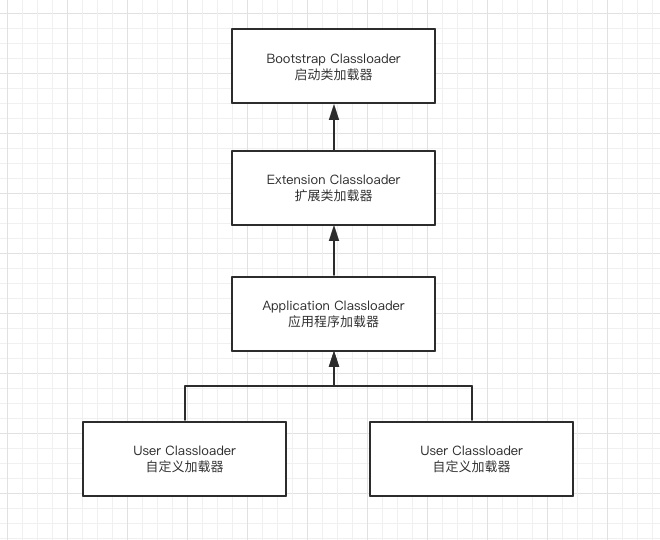
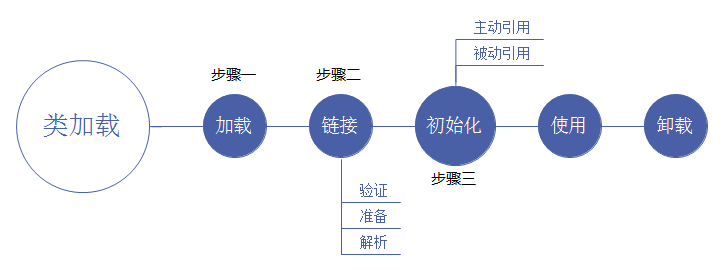

### 1.类加载器

类加载器就是根据指定全限定名称将class文件加载到JVM内存，转为Class对象。\
classloader:谈到类加载，不得不提的就是负责此项工作的类加载器classloader,classloader的职责是将Java源文件编译后的字节码文件加载到内存中去执行。

JVM中的类的加载器主要有三种:**启动类加载器，拓展类加载器，应用类加载器**。
 
- 启动类加载器(Bootstrap classLoader):又称为引导类加载器，由C++编写，无法通过程序得到。主要负责加载JAVA中的一些核心类库，主要是位于<JAVA_HOME>/lib/rt.jar中。
- 拓展类加载器(Extension classLoader):主要加载JAVA中的一些拓展类，位于<JAVA_HOME>/lib/ext中,是启动类加载器的子类。
- 应用类加载器(System classLoader):    又称为系统类加载器,主要用于加载CLASSPATH路径下我们自己写的类，是拓展类加载器的子类。
 

1. Object类是由哪个类加载器加载的?\
BootStrap ClassLoader
2. 我们自己写的类是由哪个类加载器加载的?\
System ClassLoader
3. 类加载器都是我们Java中的一个类ClassLoader的子类吗?\
BootStrap ClassLoader不是的，另外两个是的。

#### 类加载器的三大特性:委托性、可见性、单一性
**委托性**:每个类中都有一个自己的类加载器的属性，这也就是为什么可以通过Student.class.getClassLoader()来    获取自己的类加载器。当一个类加载器要加载一个类时，它会先委托自己的父类加载器来加载，只有当父加载器无法加载类时，才会自己去加载。例如我们写了一个类Student,它的类加载器是System ClassLoader,它首先会委托给它的父加载器即Extension ClassLoader,然后Extension ClassLoader又会委托给它的父加载器BootStrap ClassLoader,启动类加载器无法加载这个类，交给拓展类加载器，拓展类加载器也无法加载，然后才轮到系统类加载器进行加载。

**可见性**：可见性指的是父加载器无法利用子加载器加载的类，而子加载器可以利用父加载器加载的类。

**单一性**:一个类只会被一个类加载器加载一次，不会被重复加载。

#### 双亲委派模型
##### 1.双亲委派模型工作过程是：
如果一个类加载器收到类加载的请求，它首先不会自己去尝试加载这个类，而是把这个请求委派给父类加载器完成。每个类加载器都是如此，只有当父加载器在自己的搜索范围内找不到指定的类时（即ClassNotFoundException），子加载器才会尝试自己去加载。
##### 2. 为什么需要双亲委派模型？
有了双亲委派模型，黑客自定义的java.lang.String类永远都不会被加载进内存。因为首先是最顶端的类加载器加载系统的java.lang.String类，最终自定义的类加载器无法加载java.lang.String类。
##### 3. 如何实现双亲委派模型？
双亲委派模型的原理很简单，实现也简单。每次通过先委托父类加载器加载，当父类加载器无法加载时，再自己加载。其实ClassLoader类默认的loadClass方法已经帮我们写好了，我们无需去写。

### 2.JVM类加载器工作流程

#### 步骤一、类加载机制

当系统运行时，类加载器将.class文件的二进制数据从外部存储器（如光盘，硬盘）调入内存中，CPU再从内存中读取指令和数据进行运算，并将运算结果存入内存中。内存在该过程中充当着"二传手"的作用，通俗的讲，如果没有内存，类加载器从外部存储设备调入.class文件二进制数据直接给CPU处理，而由于CPU的处理速度远远大于调入数据的速度，容易造成数据的脱节，所以需要内存起缓冲作用。

类将.class文件加载至运行时的方法区后，会在堆中创建一个Java.lang.Class对象，用来封装类位于方法区内的数据结构，该Class对象是在加载类的过程中创建的，每个类都对应有一个Class类型的对象，Class类的构造方法是私有的，只有JVM能够创建。因此Class对象是反射的入口，使用该对象就可以获得目标类所关联的.class文件中具体的数据结构。

类加载的最终产物就是位于堆中的Class对象（注意不是目标类对象），该对象封装了类在方法区中的数据结构，并且向用户提供了访问方法区数据结构的接口，即Java反射的接口。

#### 步骤二、连接过程
（1）验证：确保被加载类的正确性，即确保被加载的类符合javac编译的规范\
（2）准备：为类的静态变量分配内存，并初始化为默认值\
（3）解析：将类中的符号引用转化为直接引用\
注：符号引用即一个Java源文件在被编译时，在不清楚被引用类实际内存地址的情况下，会使用能唯一识别并定位到目标的符号来代替。如A类引用了B类，编译时A并不知道B类实际的内存地址，故可以使用能唯一识别B的符号来代替。而当类加载时，编译后的.class文件实际已被调入内存，可知道A,B类的实际内存地址，当引用的目标已被加载入内存，则此时的引用为直接引用。

#### 步骤三、初始化
初始化过程为类的静态变量赋予正确的初始值（与连接过程的准备阶段不同，如int类型的静态变量，JVM的默认值为0，遇到static int a = 3的代码时，准备阶段首先是赋值为0，初始化阶段才赋值为3）

### 3.JVM生命周期
#### JVM生命周期可以分为以下三个阶段
- 启动：任何class文件的main函数都可认为是jvm示例的起点。
- 运行：以main函数为起点，后续的线程都由它启动，包括守护线程和用户线程。main方法启动的线程是用户线程，守护线程是JVM自己使用的线程如GC线程。
- 退出&异常退出：用户线程完全退出了，jvm示例结束生命周期。

#### JVM退出可能原因分析
（1）执行了System.exit()方法。\
（2）程序正常运行结束（程序的运行，是启动JVM的一个进程，进程中包含一个主线程去运行应用程序）\
（3）程序运行过程中遇到了异常或错误而异常退出（如在main函数中执行运行程序而不捕捉异常，而是在main方法将异常抛出，则此异常会抛至JVM致使进程终止）\
（4）操作系统异常导致的JVM进程终止（JVM向下关联不同类型的操作系统）

