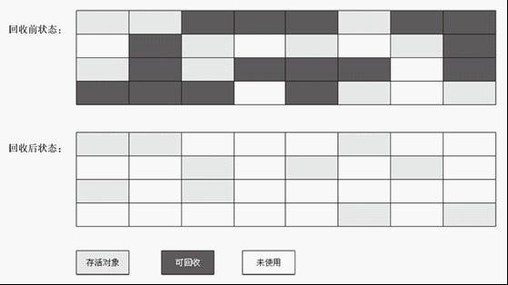
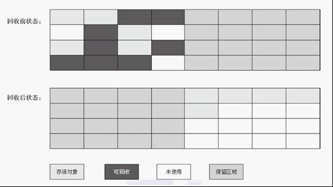
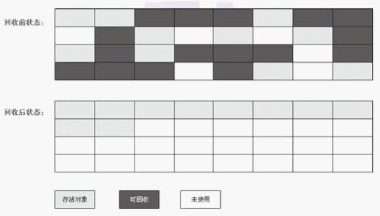

垃圾回收主要思考三件事情:

- 哪种内存需要回收？
- 什么时候回收？
- 怎么回收？
### 1.对象是否存活(哪种内存需要回收？)

#### 1.引用计数法
每当有一个地方引用一个对象的时候则在引用计数器上 +1，当失效的时候就 -1，当计数器为 0 的时候就认为该对象死亡可以回收了。\
这种算法虽然简单高效，但是却无法解决循环引用的问题，因此 Java 虚拟机并没有采用这种算法。

#### 2.可达性分析算法
主流的语言其实都是采用可达性分析算法:通过一个称为 GC Roots 的对象向下搜索，整个搜索路径就称为引用链，当一个对象到 GC Roots 没有任何引用链 JVM 就认为该对象是可以被回收的。

可以用作 GC-Roots 的对象有:
1. 方法区中静态变量所引用的对象。
2. 虚拟机栈中所引用的对象。

**对于用可达性分析法搜索不到的对象，GC并不一定会回收该对象。要完全回收一个对象，至少需要经过两次标记的过程。**
- 第一次标记：对于一个没有其他引用的对象，筛选该对象是否有必要执行finalize()方法，如果没有执行必要，则意味可直接回收。（筛选依据：是否复写或执行过finalize()方法；因为finalize方法只能被执行一次）。
- 第二次标记：如果被筛选判定位有必要执行，则会放入FQueue队列，并自动创建一个低优先级的finalize线程来执行释放操作。如果在一个对象释放前被其他对象引用，则该对象会被移除FQueue队列。

### 2.Minor GC ，Full GC 触发条件(什么时候回收？)

**Minor GC触发条件**：当Eden区满时，触发Minor GC。
    
**Full GC触发条件**：
    
（1）调用System.gc时，系统建议执行Full GC，但是不必然执行,这个命令只是建议JVM安排GC运行, 还有可能完全被拒绝\
（2）老年代空间不足\
（3）方法去空间不足\
（4）通过Minor GC后进入老年代的平均大小大于老年代的可用内存\
（5）由Eden区、From Space区向To Space区复制时，对象大小大于To Space可用内存，则把该对象转存到老年代，且老年代的可用内存小于该对象大小

#### finalize()

##### 1.在什么时候被调用?
有三种情况:
- 所有对象被Garbage Collection时自动调用,比如运行System.gc()的时候.
- 程序退出时为每个对象调用一次finalize方法。
- 显式的调用finalize方法。

##### 2.finalize()的作用

Java允许在类中定义一个名为finalize()的方法。它的工作原理是：一旦垃圾回收器准备好释放对象占用的存储空间，将首先调用其finalize()方法。并且在下一次垃圾回收动作发生时，才会真正回收对象占用的内存。

关于垃圾回收，有三点需要记住：
1. 对象可能不被垃圾回收。只要程序没有濒临存储空间用完的那一刻，对象占用的空间就总也得不到释放。
2. 垃圾回收并不等于“析构”。
3. 垃圾回收只与内存有关。使用垃圾回收的唯一原因是为了回收程序不再使用的内存。

finalize()的用途：\
无论对象是如何创建的，垃圾回收器都会负责释放对象占据的所有内存。这就将对finalize()的需求限制到一种特殊情况，即通过某种创建对象方式以外的方式为对象分配了存储空间。不过这种情况一般发生在使用“本地方法”的情况下，本地方法是一种在Java中调用非Java代码的方式。

##### 3.为什么不能显示直接调用finalize方法？
finalize方法在垃圾回收时一定会被执行，而如果在此之前显示执行的话，也就是说finalize会被执行两次以上，而在第一次资源已经被释放，那么在第二次释放资源时系统一定会报错，因此一般finalize方法的访问权限和父类保持一致，为protected。

### 3.垃圾回收算法(怎么回收？)
#### 1.标记-清除算法
标记清除算法分为两个步骤，标记和清除。 
首先将需要回收的对象标记起来，然后统一清除。但是存在两个主要的问题:
- **标记和清除的效率都不高。**
- **清除之后容易出现不连续内存**，当需要分配一个较大内存时就不得不需要进行一次垃圾回收。

#### 2.复制算法(在新生代会使用该算法)
复制算法是将内存划分为两块大小相等的区域，每次使用时都只用其中一块区域，当发生垃圾回收时会将存活的对象全部复制到未使用的区域，然后对之前的区域进行全部回收。
**这样简单高效，而且还不存在标记清除算法中的内存碎片问题，但就是有点浪费内存。**\
**在新生代会使用该算法**\
新生代中分为一个 Eden 区和两个 Survivor 区。通常两个区域的比例是 8:1:1 ，使用时会用到 Eden 区和其中一个 Survivor 区。当发生回收时则会将还存活的对象从 Eden ，Survivor 区拷贝到另一个 Survivor 区，当该区域内存也不足时则会使用分配担保利用老年代来存放内存。

#### 3.标记整理算法(老年代中使用)
**复制算法如果在存活对象较多时效率明显会降低，特别是在老年代中并没有多余的内存区域可以提供内存担保。**\
所以老年代中使用的时候标记整理算法，它的原理和标记清除算法类似，只是最后一步的清除改为了将存活对象全部移动到一端，然后再将边界之外的内存全部回收。

#### 4.分代回收算法
现代多数的商用 JVM 的垃圾收集器都是采用的分代回收算法，和之前所提到的算法并没有新的内容。\
只是将 Java 堆分为了新生代和老年代。**由于新生代中存活对象较少，所以采用复制算法，简单高效。**\
而老年代中对象较多，并且没有可以担保的内存区域，所以**一般采用标记清除或者是标记整理算法**。

#### 垃圾回收算法总结
1、三个算法都基于根搜索算法去判断一个对象是否应该被回收，而支撑根搜索算法可以正常工作的理论依据，就是语法中变量作用域的相关内容。\
因此，**要想防止内存泄露，最根本的办法就是掌握好变量作用域**。\
2、在GC线程开启时，或者说GC过程开始时，它们都要暂停应用程序（stop the world）。

从下面几个方面比较：（>表示前者要优于后者，=表示两者效果一样）
- 效率：复制算法>标记/整理算法>标记/清除算法。
- 内存整齐度：复制算法=标记/整理算法>标记/清除算法。
- 内存利用率：标记/整理算法=标记/清除算法>复制算法。

### 4.垃圾回收器

#### 1.Serial收集器(新生代/Client模式优选)
Serial是**单线程**的收集器。它在进行垃圾收集时，必须暂停其他所有的工作线程，直到它收集完成。

#### 2.ParNew收集器(新生代/Server模式优选)
ParNew收集器其实就是Serial收集器的**多线程**版本

#### 3.Parallel Scavenge（并行回收）收集器(新生代)   
Parallel Scavenge是使用**复制算法**的收集器，又是**并行的多线程收集器**\
该收集器的目标是达到一个可控制的吞吐量（Throughput）。\
所谓吞吐量就是CPU用于运行用户代码的时间与CPU总消耗时间的比值，即 吞吐量=运行用户代码时间/（运行用户代码时间+垃圾收集时间）\
停顿时间越短就越适合需要与用户交互的程序，良好的响应速度能提升用户体验，而高吞吐量则可用高效率地利用CPU时间，
尽快完成程序的运算任务，**主要适合在后台运算而不需要太多交互的任务**。

#### 4.Serial Old 收集器(老年代/Client模式)
Serial Old是Serial收集器的老年代版本，它同样是一个**单线程**收集器，使用**标记整理算法**。

#### 5.Parallel Old 收集器(老年代)
Parallel Old 是Parallel Scavenge收集器的老年代版本，使用**多线程**和“**标记-整理**”算法。

#### 6.CMS收集器
     
CMS(Concurrent Mark Sweep)收集器是一种以**获取最短回收停顿时间**为目标的收集器。目前很大一部分的Java应用集中在互联网站或者B/S系统的服务端上，这类应用**尤其重视服务器的响应速度，希望系统停顿时间最短**，以给用户带来较好的体验。CMS收集器就非常符合这类应用的需求
CMS收集器是基于“**标记-清除**”算法实现的。它的运作过程相对前面几种收集器来说更复杂一些，整个过程分为4个步骤：\
（1）初始标记\
（2）并发标记\
（3）重新标记\
（4）并发清除\
其中，初始标记、重新标记这两个步骤仍然需要“Stop The World”.

**CMS收集器主要优点：并发收集，低停顿。**

CMS三个明显的缺点：\
（1）**CMS收集器对CPU资源非常敏感**。CPU个数少于4个时，CMS对于用户程序的影响就可能变得很大，为了应付这种情况，虚拟机提供了一种称为“增量式并发收集器”的CMS收集器变种。所做的事情和单CPU年代PC机操作系统使用抢占式来模拟多任务机制的思想

（2）**CMS收集器无法处理浮动垃圾**，可能出现“Concurrent Mode Failure”失败而导致另一次Full GC的产生。在JDK1.5的默认设置下，CMS收集器当老年代使用了68%的空间后就会被激活，这是一个偏保守的设置，如果在应用中蓝年代增长不是太快，可以适当调高参数-XX:CMSInitiatingOccupancyFraction的值来提高触发百分比，以便降低内存回收次数从而获取更好的性能，在JDK1.6中，CMS收集器的启动阀值已经提升至92%。

（3）CMS是基于“标记-清除”算法实现的收集器，收集结束时会有大量空间碎片产生。空间碎片过多，可能会出现老年代还有很大空间剩余，但是无法找到足够大的连续空间来分配当前对象，不得不提前出发FullGC。为了解决这个问题，CMS收集器提供了一个-XX:+UseCMSCompactAtFullCollection开关参数（默认就是开启的），用于在CMS收集器顶不住要进行FullGC时开启内存碎片合并整理过程，内存整理的过程是无法并发的，空间碎片问题没有了，但停顿时间变长了。虚拟机设计者还提供了另外一个参数-XX:CMSFullGCsBeforeCompaction,这个参数是用于设置执行多少次不压缩的Full GC后，跟着来一次带压缩的（默认值为0，标识每次进入Full GC时都进行碎片整理）

#### 7. G1收集器
     
G1收集器的优势：
     
（1）并行与并发\
（2）分代收集\
（3）空间整理 （标记整理算法，复制算法）\
（4）可预测的停顿（G1处处理追求低停顿外，还能建立可预测的停顿时间模型，能让使用者明确指定在一个长度为M毫秒的时间片段内，消耗在垃圾收集上的时间不得超过N毫秒，这几乎已经实现Java（RTSJ）的来及收集器的特征）

使用G1收集器时，**Java堆的内存布局是整个规划为多个大小相等的独立区域（Region）**,虽然还保留有新生代和老年代的概念，但新生代和老年代不再是物理隔离的了，它们都是一部分Region的集合。
     
**G1收集器之所以能建立可预测的停顿时间模型，是因为它可以有计划地避免在真个Java堆中进行全区域的垃圾收集**。G1跟踪各个Region里面的垃圾堆积的价值大小（回收所获取的空间大小以及回收所需要的时间的经验值），在后台维护一个优先列表，每次根据允许的收集时间，优先回收价值最大的Region（这也就是Garbage-First名称的又来）。这种使用Region划分内存空间以及有优先级的区域回收方式，保证了G1收集器在有限的时间内可以获取尽量可能高的灰机效率
     
G1 内存“化整为零”的思路\
在GC根节点的枚举范围中加入Remembered Set即可保证不对全堆扫描也不会遗漏。   
如果不计算维护Remembered Set的操作，G1收集器的运作大致可划分为一下步骤：     
（1）初始标记\
（2）并发标记\
（3）最终标记\
（4）筛选回收

