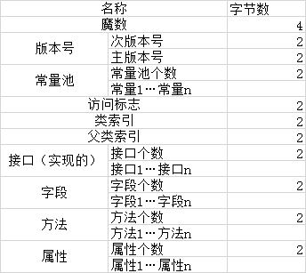
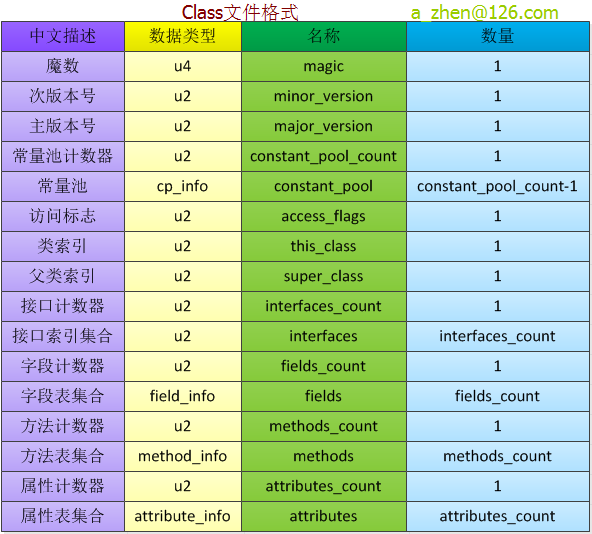
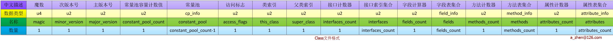
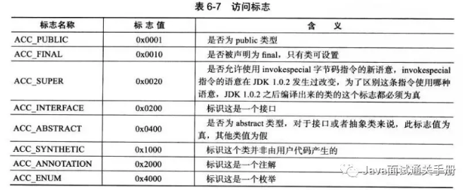

简版：

复杂版：

横版：

**部分字段解析**
#### 1.魔数
魔数的唯一作用是确定这个文件是否为一个能被虚拟机接收的Class文件。

#### 2.常量池
常量池可以理解为Class文件之中的资源仓库，**常量池主要存放两大常量：字面量和符号引用**。\
字面量比较接近于java语言层面的的常量概念，如文本字符串、声明为final的常量值等。而符号引用则属于编译原理方面的概念。包括下面三类常量：
- 类和接口的全限定名
- 字段的名称和描述符
- 方法的名称和描述符

#### 3.访问标志
这个标志用于识别一些类或者接口层次的访问信息，包括：这个Class是类还是接口，是否为public或者abstract类型，如果是类的话是否声明为final等等。

#### 4.类索引、父类索引与接口索引集合
**Class文件由这三项数据来确定这个类的继承关系。**\
**类索引用于确定这个类的全限定名，父类索引用于确定这个类的父类的全限定名**，由于java语言的单继承，所以父类索引只有一个，\
除了java.lang.Object之外，所有的java类都有父类，因此**除了java.lang.Object外，所有java类的父类索引都不为0**。\
接口索引集合用来描述这个类实现了那些接口，这些被实现的接口将按implents(如果这个类本身是接口的话则是extends)后的接口顺序从左到右排列在接口索引集合中。

#### 5.字段表集合
字段表（field info）用于描述接口或类中声明的变量。字段包括类级变量以及实例变量，但不包括在方法内部声明的局部变量。
字段的作用域（public ,private,protected修饰符），是实例变量还是类变量（static修饰符）、可变性（final）、并发可见性（volatile修饰符，是否强制从主内存读写）、可否被序列化（transient修饰符）、字段数据类型、字段名称。\
上述这些信息中，各个修饰符都是布尔值，要么有某个修饰符，要么没有，很适合使用标志位来表示。而字段叫什么名字、字段被定义为什么数据类型这些都是无法固定的，只能引用常量池中常量来描述。

#### 6.方法表集合
方法表的结构如同字段表一样，依次包括了访问标志、名称索引、描述符索引、属性表集合几项。\
因为volatile修饰符和transient修饰符不可以修饰方法，所以方法表的访问标志中没有这两个对应的标志，但是增加了synchronized、native、abstract等关键字修饰方法，所以也就多了这些关键字对应的标志。

#### 7. 属性表结合
在Class文件，**字段表，方法表中都可以携带自己的属性表集合**，以用于描述某些场景专有的信息。与Class文件中其它的数据项目要求的顺序、长 度和内容不同，属性表集合的限制稍微宽松一些，不再要求各个属性表具有严格的顺序，并且只要不与已有的属性名重复，任何人实现的编译器都可以向属性表中写 入自己定义的属性信息，Java虚拟机运行时会忽略掉它不认识的属性。

