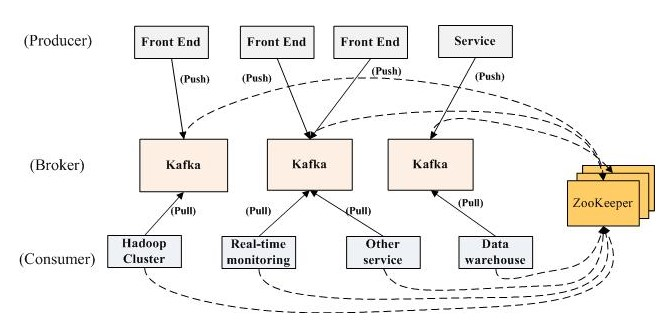

### 1、Kafka 的主要特点？
1. 同时为发布和订阅提供高吞吐量。据了解，Kafka 每秒可以生产约 25 万消息（50MB），每秒处理 55 万消息（110MB）。
2. 可进行持久化操作。将消息持久化到磁盘，因此可用于批量消费，例如 ETL ，以及实时应用程序。通过将数据持久化到硬盘，以及replication ，可以防止数据丢失。
3. 分布式系统，易于向外扩展。所有的 Producer、Broker 和Consumer 都会有多个，均为分布式的。并且，无需停机即可扩展机器。
4. 消息被处理的状态是在 Consumer 端维护，而不是由 Broker 端维护。当失败时，能自动平衡。
5. 支持 online 和 offline 的场景。

### 2、Kafka 的设计要点？
  
#### 2.1 吞吐量
高吞吐是 Kafka 需要实现的核心目标之一，为此 kafka 做了以下一些设计：\
1. **数据磁盘持久化**：消息不在内存中 Cache ，直接写入到磁盘，充分利用磁盘的顺序读写性能。直接使用 Linux 文件系统的 Cache ，来高效缓存数据。
2. **zero-copy**：减少 IO 操作步骤，采用 Linux Zero-Copy 提高发送性能。
>传统的数据发送需要发送 4 次上下文切换。\
采用 sendfile 系统调用之后，数据直接在内核态交换，系统上下文切换减少为 2 次。根据测试结果，可以提高 60% 的数据发送性能。

3. **数据批量发送**
4. **数据压缩**
5. **Topic 划分为多个 Partition ，提高并行度**。
>数据在磁盘上存取代价为 O(1)。\
Kafka 以 Topic 来进行消息管理，每个 Topic 包含多个 Partition ，每个 Partition 对应一个逻辑 log ，有多个 segment 文件组成。\
每个 segment 中存储多条消息，消息 id 由其逻辑位置决定，即从消息 id 可直接定位到消息的存储位置，避免 id 到位置的额外映射。\
每个 Partition 在内存中对应一个 index ，记录每个 segment 中的第一条消息偏移。\
发布者发到某个 Topic 的消息会被均匀的分布到多个 Partition 上（随机或根据用户指定的回调函数进行分布），Broker 收到发布消息往对应 Partition 的最后一个 segment 上添加该消息。\
当某个 segment上 的消息条数达到配置值或消息发布时间超过阈值时，segment上 的消息会被 flush 到磁盘，只有 flush 到磁盘上的消息订阅者才能订阅到，segment 达到一定的大小后将不会再往该 segment 写数据，Broker 会创建新的 segment 文件。

#### 2.2 负载均衡
1. Producer 根据用户指定的算法，将消息发送到指定的 Partition 中。
2. Topic 存在多个 Partition ，每个 Partition 有自己的replica ，每个 replica 分布在不同的 Broker 节点上。多个Partition 需要选取出 Leader partition ，Leader Partition 负责读写，并由 Zookeeper 负责 fail over 。
3. 相同 Topic 的多个 Partition 会分配给不同的 Consumer 进行拉取消息，进行消费。

#### 2.3 拉取系统
由于 Kafka Broker 会持久化数据，Broker 没有内存压力，因此， Consumer 非常适合采取 pull 的方式消费数据，具有以下几点好处：
1. 简化 Kafka 设计。
2. Consumer 根据消费能力自主控制消息拉取速度。
3. Consumer 根据自身情况自主选择消费模式，例如批量，重复消费，从尾端开始消费等。

#### 2.4 可扩展性
通过 Zookeeper 管理 Broker 与 Consumer 的动态加入与离开。
1. 当需要增加 Broker 节点时，新增的 Broker 会向 Zookeeper 注册，而 Producer 及 Consumer 会根据注册在 Zookeeper 上的 watcher 感知这些变化，并及时作出调整。
2. 当新增和删除 Consumer 节点时，相同 Topic 的多个 Partition 会分配给剩余的 Consumer 们。

### 3、Kafka的整体架构
Kafka 的整体架构非常简单，是分布式架构，Producer、Broker 和Consumer 都可以有多个。\


- Producer，Consumer 实现 Kafka 注册的接口。
- 数据从 Producer 发送到 Broker 中，Broker 承担一个中间缓存和分发的作用。
- Broker 分发注册到系统中的 Consumer。Broker 的作用类似于缓存，即活跃的数据和离线处理系统之间的缓存。
- 客户端和服务器端的通信，是基于简单，高性能，且与编程语言无关的 TCP 协议。

**几个重要的基本概念：**
1. Topic：特指 Kafka 处理的消息源（feeds of messages）的不同分类。
1. Partition：Topic 物理上的分组（分区），一个 Topic 可以分为多个 Partition 。每个 Partition 都是一个有序的队列。Partition 中的每条消息都会被分配一个有序的 id（offset）。
    1. replicas：Partition 的副本集，保障 Partition 的高可用。
    1. leader：replicas 中的一个角色，Producer 和 Consumer 只跟 Leader 交互。
    1. follower：replicas 中的一个角色，从 leader 中复制数据，作为副本，一旦 leader 挂掉，会从它的 followers 中选举出一个新的 leader 继续提供服务。
1. Message：消息，是通信的基本单位，每个 Producer 可以向一个Topic（主题）发布一些消息。
1. Producers：消息和数据的生产者，向 Kafka 的一个 Topic 发布消息的过程，叫做 producers 。
1. Consumers：消息和数据的消费者，订阅 Topic ，并处理其发布的消息的过程，叫做 consumers 。
1. Consumer group：每个 Consumer 都属于一个 Consumer group，每条消息只能被同一个Consumer group 中的一个 Consumer 消费，但可以被多个 Consumer group 消费。
1. Broker：缓存代理，Kafka 集群中的一台或多台服务器统称为 broker 。
1. Controller：Kafka 集群中，通过 Zookeeper 选举某个 Broker 作为 Controller ，用来进行 leader election 以及 各种 failover 。
1. ZooKeeper：Kafka 通过 ZooKeeper 来存储集群的 Topic、Partition 等元信息等。

**Kafka 为什么要将 Topic 进行分区？**\
Topic 只是逻辑概念，面向的是 Producer 和 Consumer ，而 Partition 则是物理概念。如果 Topic 不进行分区，而将 Topic 内的消息存储于一个 Broker，那么关于该 Topic 的所有读写请求都将由这一个 Broker 处理，吞吐量很容易陷入瓶颈，这显然是不符合高吞吐量应用场景的。\
有了 Partition 概念以后，假设一个 Topic 被分为 10 个 Partitions ，Kafka 会根据一定的算法将 10 个 Partition 尽可能均匀的分布到不同的 Broker（服务器）上。\
当 Producer 发布消息时，Producer 客户端可以采用 random、key-hash 及轮询等算法选定目标 Partition ，若不指定，Kafka 也将根据一定算法将其置于某一分区上。\
当 Consumer 拉取消息时，Consumer 客户端可以采用 Range、轮询 等算法分配 Partition ，从而从不同的 Broker 拉取对应的 Partition 的 leader 分区。\
所以，Partiton 机制可以极大的提高吞吐量，并且使得系统具备良好的水平扩展能力。

### 4、Kafka 的应用场景有哪些？
#### 1）消息队列
比起大多数的消息系统来说，Kafka 有更好的吞吐量，内置的分区，冗余及容错性，这让 Kafka 成为了一个很好的大规模消息处理应用的解决方案。消息系统一般吞吐量相对较低，但是需要更小的端到端延时，并常常依赖于 Kafka 提供的强大的持久性保障。在这个领域，Kafka 足以媲美传统消息系统，如 ActiveMQ 或 RabbitMQ 。
#### 2）行为跟踪
Kafka 的另一个应用场景，是跟踪用户浏览页面、搜索及其他行为，以发布订阅的模式实时记录到对应的 Topic 里。那么这些结果被订阅者拿到后，就可以做进一步的实时处理，或实时监控，或放到 Hadoop / 离线数据仓库里处理。
#### 3）元信息监控
作为操作记录的监控模块来使用，即汇集记录一些操作信息，可以理解为运维性质的数据监控吧。
#### 4）日志收集
日志收集方面，其实开源产品有很多，包括 Scribe、Apache Flume 。很多人使用 Kafka 代替日志聚合（log aggregation）。日志聚合一般来说是从服务器上收集日志文件，然后放到一个集中的位置（文件服务器或 HDFS）进行处理。\
然而， Kafka 忽略掉文件的细节，将其更清晰地抽象成一个个日志或事件的消息流。这就让 Kafka 处理过程延迟更低，更容易支持多数据源和分布式数据处理。比起以日志为中心的系统比如 Scribe 或者 Flume 来说，Kafka 提供同样高效的性能和因为复制导致的更高的耐用性保证，以及更低的端到端延迟。
#### 5）流处理
这个场景可能比较多，也很好理解。保存收集流数据，以提供之后对接的 Storm 或其他流式计算框架进行处理。很多用户会将那些从原始 Topic 来的数据进行阶段性处理，汇总，扩充或者以其他的方式转换到新的 Topic 下再继续后面的处理。\
例如一个文章推荐的处理流程，可能是先从 RSS 数据源中抓取文章的内容，然后将其丢入一个叫做“文章”的 Topic 中。后续操作可能是需要对这个内容进行清理，比如回复正常数据或者删除重复数据，最后再将内容匹配的结果返还给用户。这就在一个独立的 Topic 之外，产生了一系列的实时数据处理的流程。Strom 和 Samza 是非常著名的实现这种类型数据转换的框架。
#### 6）事件源
事件源，是一种应用程序设计的方式。该方式的状态转移被记录为按时间顺序排序的记录序列。Kafka 可以存储大量的日志数据，这使得它成为一个对这种方式的应用来说绝佳的后台。比如动态汇总（News feed）。
#### 7）持久性日志（Commit Log）
Kafka 可以为一种外部的持久性日志的分布式系统提供服务。这种日志可以在节点间备份数据，并为故障节点数据回复提供一种重新同步的机制。Kafka 中日志压缩功能为这种用法提供了条件。在这种用法中，Kafka 类似于 Apache BookKeeper 项目。

### 5、Kafka 消息发送和消费的简化流程是什么？
1. Producer: 根据指定的 partition 方法（round-robin、hash等），将消息发布到指定 Topic 的 Partition 里面。
2. Kafka 集群: 接收到 Producer 发过来的消息后，将其持久化到硬盘，并保留消息指定时长（可配置），而不关注消息是否被消费。
3. Consumer: 从 Kafka 集群 pull 数据，并控制获取消息的 offset 。至于消费的进度，可手动或者自动提交给 Kafka 集群。

#### 5.1 Producer 发送消息
Producer 采用 push 模式将消息发布到 Broker，每条消息都被 append 到 Patition 中，属于顺序写磁盘（顺序写磁盘效率比随机写内存要高，保障 Kafka 吞吐率）。Producer 发送消息到 Broker 时，会根据分区算法选择将其存储到哪一个 Partition 。\
其路由机制为：
1. 指定了 Partition ，则直接使用。
2. 未指定 Partition 但指定 key ，通过对 key 进行 hash 选出一个 Partition 。
3. Partition 和 key 都未指定，使用轮询选出一个 Partition 。

写入流程：
1. Producer 先从 ZooKeeper 的 "/brokers/.../state" 节点找到该 Partition 的 leader 。注意: Producer 只和 Partition 的 leader 进行交互。
2. Producer 将消息发送给该 leader 。
3. leader 将消息写入本地 log 。
4. followers 从 leader pull 消息，写入本地 log 后 leader 发送 ACK 。
5. leader 收到所有 ISR 中的 replica 的 ACK 后，增加 HW（high watermark ，最后 commit 的 offset） 并向 Producer 发送 ACK 。

#### 5.2 Broker 存储消息
物理上把 Topic 分成一个或多个 Patition，每个 Patition 物理上对应一个文件夹（该文件夹存储该 Patition 的所有消息和索引文件）。

#### 5.3 Consumer 消费消息
high-level Consumer API 提供了 consumer group 的语义，一个消息只能被 group 内的一个 Consumer 所消费，且 Consumer 消费消息时不关注 offset ，最后一个 offset 由 ZooKeeper 保存（下次消费时，该 group 中的 Consumer 将从 offset 记录的位置开始消费）。\
注意：
1. 如果消费线程大于 Patition 数量，则有些线程将收不到消息。
2. 如果 Patition 数量大于消费线程数，则有些线程多收到多个 Patition 的消息。
3. 如果一个线程消费多个 Patition，则无法保证你收到的消息的顺序，而一个 Patition 内的消息是有序的。

**Consumer 采用 pull 模式从 Broker 中读取数据。**
- push 模式，很难适应消费速率不同的消费者，因为消息发送速率是由 Broker 决定的。它的目标是尽可能以最快速度传递消息，但是这样很容易造成 Consumer 来不及处理消息，典型的表现就是拒绝服务以及网络拥塞。而 pull 模式，则可以根据 Consumer 的消费能力以适当的速率消费消息。
- 对于 Kafka 而言，pull 模式更合适，它可简化 Broker 的设计，Consumer 可自主控制消费消息的速率，同时 Consumer 可以自己控制消费方式——即可批量消费也可逐条消费，同时还能选择不同的提交方式从而实现不同的传输语义。

#### 5.4 Kafka Producer 有哪些发送模式？   
Kafka 的发送模式由 Producer 端的配置参数 producer.type来设置。\
这个参数指定了在后台线程中消息的发送方式是同步的还是异步的，**默认是同步的方式，即 producer.type=sync** 。\
如果设置成异步的模式，即 producer.type=async ，可以是 Producer 以 batch 的形式 push 数据，这样会极大的提高 Broker的性能，但是这样会增加丢失数据的风险。\
**如果需要确保消息的可靠性，必须要将 producer.type设置为 sync 。**\
对于异步模式，还有 4 个配套的参数，如下：


- 以 batch 的方式推送数据可以极大的提高处理效率，Kafka Producer 可以将消息在内存中累计到一定数量后作为一个 batch 发送请求。batch 的数量大小可以通过 Producer 的参数（batch.num.messages）控制。通过增加 batch 的大小，可以减少网络请求和磁盘 IO 的次数，当然具体参数设置需要在效率和时效性方面做一个权衡。
- 在比较新的版本中还有 batch.size 这个参数。Producer 会尝试批量发送属于同一个 Partition 的消息以减少请求的数量. 这样可以提升客户端和服务端的性能。默认大小是 16348 byte (16k).
    - 发送到 Broker 的请求可以包含多个 batch ，每个 batch 的数据属于同一个 Partition 。
    - 太小的 batch 会降低吞吐. 太大会浪费内存。

#### 5.5 Kafka Consumer 是否可以消费指定的分区消息？
Consumer 消费消息时，向 Broker 发出“fetch”请求去消费特定分区的消息，Consumer 指定消息在日志中的偏移量(offset)，就可以消费从这个位置开始的消息，Consumer 拥有了 offset 的控制权，可以向后回滚去重新消费之前的消息，这是很有意义的。

#### 5.6 Kafka 的 high-level API 和 low-level API 的区别？
- High Level API\
屏蔽了每个 Topic 的每个 Partition 的 offset 管理（自动读取Zookeeper 中该 Consumer group 的 last offset）、Broker 失败转移、以及增减 Partition 时 Consumer 时的负载均衡（Kafka 自动进行负载均衡）。\
如果 Consumer 比 Partition 多，是一种浪费。一个 Partition 上是不允许并发的，所以 Consumer 数不要大于 Partition 数。

- Low Level API\
Low-level API 也就是 Simple Consumer API ，实际上非常复杂。\
API 控制更灵活，例如消息重复读取，消息 offset 跳读，Exactly Once 原语。\
API 更复杂，offset 不再透明，需要自己管理，Broker 自动失败转移需要处理，增加 Consumer、Partition、Broker 需要自己做负载均衡。

### 6、Kafka 的网络模型是怎么样的？
Kafka 基于高吞吐率和效率考虑，并没有使用第三方网络框架，而且自己基于 Java NIO 封装的。
- KafkaClient: 单线程 Selector 模型。
`实际上，就是 NettyClient 的 NIO 方式。`
>单线程模式适用于并发链接数小，逻辑简单，数据量小。\
在 Kafka 中，Consumer 和 Producer 都是使用的上面的单线程模式。这种模式不适合 Kafka 的服务端，在服务端中请求处理过程比较复杂，会造成线程阻塞，一旦出现后续请求就会无法处理，会造成大量请求超时，引起雪崩。而在服务器中应该充分利用多线程来处理执行逻辑。

- KafkaServer: 多线程 Selector 模型。
`实际上，就是 NettyServer 的 NIO 方式。`
>KafkaServer ，指的是 Kafka Broker 。\
Broker 的内部处理流水线化，分为多个阶段来进行(SEDA)，以提高吞吐量和性能，尽量避免 Thead 盲等待，以下为过程说明。\
Accept Thread 负责与客户端建立连接链路，然后把 Socket 轮转交给Process Thread 。\
Process Thread 负责接收请求和响应数据，Process Thread 每次基于 Selector 事件循环，首先从 Response Queue 读取响应数据，向客户端回复响应，然后接收到客户端请求后，读取数据放入 Request Queue 。\
Work Thread 负责业务逻辑、IO 磁盘处理等，负责从 Request Queue 读取请求，并把处理结果放入 Response Queue 中，待 Process Thread 发送出去。相当于业务线程池。

解释如何提高远程用户的吞吐量?\
如果 Producer、Consumer 位于与 Broker 不同的数据中心，则可能需要调优套接口缓冲区大小，以对长网络延迟进行摊销。

### 7、Kafka 的数据存储模型是怎么样的?
Kafka 每个 Topic 下面的所有消息都是以 Partition 的方式分布式的存储在多个节点上。同时在 Kafka 的机器上，每个 Partition 其实都会对应一个日志目录，在目录下面会对应多个日志分段（LogSegment）。
```java
MacBook-Pro-5:test-0 yunai$ ls
00000000000000000000.index	00000000000000000000.timeindex	leader-epoch-checkpoint
00000000000000000000.log	00000000000000000004.snapshot
```
Topic 为 test ，Partition 为 0 ，所以文件目录是 test-0 。\
LogSegment 文件由两部分组成，分别为 .index 文件和 .log 文件，分别表示为 segment 索引文件和数据文件。\
这两个文件的命令规则为：Partition 全局的第一个 segment 从 0 开始，后续每个 segment 文件名为上一个 segment 文件最后一条消息的 offset 值，数值大小为 64 位，20 位数字字符长度，没有数字用 0 填充，如下，假设有 1000 条消息，每个 LogSegment 大小为 100 ，下面展现了 900-1000 的 .index 和 .log 文件：


由于 Kafka 消息数据太大，如果全部建立索引，即占了空间又增加了耗时，所以 Kafka 选择了稀疏索引的方式（通过 .index 索引 .log 文件），这样的话索引可以直接进入内存，加快偏查询速度。

### 8、简单介绍一下如何读取数据？
```text
如果我们要读取第 911 条数据。
首先第一步，找到它是属于哪一段的，根据二分法查找到他属于的文件，找到 0000900.index 和 00000900.log 之后。
然后，去 .index 中去查找 (911-900) =11 这个索引或者小于 11 最近的索引，在这里通过二分法我们找到了索引是 [10,1367] 。
10 表示，第 10 条消息开始。
1367 表示，在 .log 的第 1367 字节开始。
所以，本图的第 911 条的“1360”是错的，相比“1367” 反倒小了。
然后，我们通过这条索引的物理位置 1367 ，开始往后找，直到找到 911 条数据。
```  
上面讲的是如果要找某个 offset 的流程，但是我们大多数时候并不需要查找某个 offset ，只需要按照顺序读即可。而在顺序读中，操作系统会对内存和磁盘之间添加 page cahe ，也就是我们平常见到的预读操作，所以我们的顺序读操作时速度很快。但是 Kafka 有个问题，如果分区过多，那么日志分段也会很多，写的时候由于是批量写，其实就会变成随机写了，随机 I/O 这个时候对性能影响很大。所以一般来说 Kafka 不能有太多的Partition 。针对这一点，RocketMQ 把所有的日志都写在一个文件里面，就能变成顺序写，通过一定优化，读也能接近于顺序读。

### 9、为什么不能以 Partition 作为存储单位？
如果就以 Partition 为最小存储单位，可以想象，当 Kafka Producer 不断发送消息，必然会引起 Partition 文件的无限扩张，将对消息文件的维护以及已消费的消息的清理带来严重的影响，因此，需以 segment 为单位将 Partition 进一步细分。\
每个 Partition（目录）相当于一个巨型文件，被平均分配到多个大小相等的 segment（段）数据文件中（每个 segment 文件中消息数量不一定相等），这种特性也方便 old segment 的删除，即方便已被消费的消息的清理，提高磁盘的利用率。每个 Partition 只需要支持顺序读写就行，segment 的文件生命周期由服务端配置参数（log.segment.bytes，log.roll.{ms,hours} 等若干参数）决定。

### 10、Kafka 的消息格式是怎么样的？


value bytes payload	表示实际消息数据

### 11、Kafka 的副本机制是怎么样的？
Kafka 的副本机制，是多个 Broker 节点对其他节点的 Topic 分区的日志进行复制。当集群中的某个节点出现故障，访问故障节点的请求会被转移到其他正常节点(这一过程通常叫 Reblance)，Kafka 每个主题的每个分区都有一个主副本以及 0 个或者多个副本，副本保持和主副本的数据同步，当主副本出故障时就会被替代。\
注意这里面所说的 Leader 指的是每个 Topic 的某个分区的 Leader ，而不是 Broker 集群中的【集群控制器】。\
在 Kafka 中并不是所有的副本都能被拿来替代主副本，所以在 Kafka 的Leader 节点中维护着一个 ISR（In sync Replicas）集合，翻译过来也叫正在同步中集合，在这个集合中的需要满足两个条件:
1. 节点必须和 Zookeeper 保持连接。
2. 在同步的过程中这个副本不能落后主副本太多。

另外还有个 AR（Assigned Replicas）用来标识副本的全集，OSR 用来表示由于落后被剔除的副本集合，所以公式如下：
- ISR = Leader + 没有落后太多的副本。
- AR = OSR + ISR 。

HW（高水位 HighWatermark），是 Consumer 能够看到的此 Partition 的位置。\
LEO（logEndOffset），是每个 Partition 的 log 最后一条 Message 的位置。\
HW 能保证 Leader 所在的 Broker 失效，该消息仍然可以从新选举的Leader 中获取，不会造成消息丢失。

当 Producer 向 Leader 发送数据时，可以通过request.required.acks 参数来设置数据可靠性的级别：
- 1（默认）：这意味着 Producer 在 ISR 中的 Leader 已成功收到的数据并得到确认后发送下一条 message 。如果 Leader 宕机了，则会丢失数据。
- 0：这意味着 Producer 无需等待来自 Broker 的确认而继续发送下一批消息。这种情况下数据传输效率最高，但是数据可靠性确是最低的。
- -1：Producer 需要等待 ISR 中的所有 Follower 都确认接收到数据后才算一次发送完成，可靠性最高。但是这样也不能保证数据不丢失，比如当 ISR 中只有 Leader 时(其他节点都和 Zookeeper 断开连接，或者都没追上)，这样就变成了 acks=1 的情况。

### 12、ZooKeeper 在 Kafka 中起到什么作用？
1. Broker 在 ZooKeeper 中的注册。
2. Topic 在 ZooKeeper 中的注册。
3. Consumer 在 ZooKeeper 中的注册。
4. Producer 负载均衡。
>主要指的是，Producer 从 Zookeeper 拉取 Topic 元数据，从而能够将消息发送负载均衡到对应 Topic 的分区中。
5. Consumer 负载均衡。
6. 记录消费进度 Offset 。
>Kafka 已推荐将 consumer 的 Offset 信息保存在 Kafka 内部的 Topic 中。
7. 记录 Partition 与 Consumer 的关系。    
      
### 13、Kafka如何保证高可用性?
Kafka 一个最基本的架构认识：由多个 broker 组成，每个 broker 是一个节点；你创建一个 topic，这个 topic 可以划分为多个 partition，每个 partition 可以存在于不同的 broker 上，每个 partition 就放一部分数据。\
这就是天然的分布式消息队列，**就是说一个 topic 的数据，是分散放在多个机器上的，每个机器就放一部分数据**。\
实际上 RabbmitMQ 之类的，并不是分布式消息队列，它就是传统的消息队列，只不过提供了一些集群、HA(High Availability, 高可用性) 的机制而已，因为无论怎么玩儿，RabbitMQ 一个 queue 的数据都是放在一个节点里的，镜像集群下，也是每个节点都放这个 queue 的完整数据。

Kafka就是 replica（复制品） 副本机制。每个 partition 的数据都会同步到其它机器上，形成自己的多个 replica 副本。所有 replica 会选举一个 leader 出来，那么生产和消费都跟这个 leader 打交道，然后其他 replica 就是 follower。写的时候，leader 会负责把数据同步到所有 follower 上去，读的时候就直接读 leader 上的数据即可。只能读写 leader？很简单，要是你可以随意读写每个 follower，那么就要 care 数据一致性的问题，系统复杂度太高，很容易出问题。Kafka 会均匀地将一个 partition 的所有 replica 分布在不同的机器上，这样才可以提高容错性。

如果某个 broker 宕机了，该broker上面的 partition 在其他机器上都有副本的，如果这上面有某个 partition 的 leader，那么此时会从 follower 中重新选举一个新的 leader 出来，大家继续读写那个新的 leader 即可。这就有所谓的高可用性了。\
`写数据的时候`，生产者就写 leader，然后 leader 将数据落地写本地磁盘，接着其他 follower 自己主动从 leader 来 pull 数据。一旦所有 follower 同步好数据了，就会发送 ack 给 leader，leader 收到所有 follower 的 ack 之后，就会返回写成功的消息给生产者。\
`消费的时候`，只会从 leader 去读，但是只有当一个消息已经被所有 follower 都同步成功返回 ack 的时候，这个消息才会被消费者读到。

其他参考答案:
```text
Zookeeper 部署 2N+1 节点，形成 Zookeeper 集群，保证高可用。
Kafka Broker 部署集群。每个 Topic 的 Partition ，基于【副本机制】，在 Broker 集群中复制，形成 replica 副本，保证消息存储的可靠性。每个 replica 副本，都会选择出一个 leader 分区（Partition），提供给客户端（Producer 和 Consumer）进行读写。
Kafka Producer 无需考虑集群，因为和业务服务部署在一起。Producer 从 Zookeeper 拉取到 Topic 的元数据后，选择对应的 Topic 的 leader 分区，进行消息发送写入。而 Broker 根据 Producer 的 request.required.acks 配置，是写入自己完成就响应给 Producer 成功，还是写入所有 Broker 完成再响应。这个，就是胖友自己对消息的可靠性的选择。
Kafka Consumer 部署集群。每个 Consumer 分配其对应的 Topic Partition ，根据对应的分配策略。并且，Consumer 只从 leader 分区（Partition）拉取消息。另外，当有新的 Consumer 加入或者老的 Consumer 离开，都会将 Topic Partition 再均衡，重新分配给 Consumer 。
```
总的来说，Kafka 和 RocketMQ 的高可用方式是比较类似的，主要的差异在 Kafka Broker 的副本机制，和 RocketMQ Broker 的主从复制，两者的差异，以及差异带来的生产和消费不同。
当然，实际上，都是和“主” Broker 做消息的发送和读取不是？！

### 14、如何保证消息不被重复消费？
即如何保证消息消费时的幂等性


**底层根本原因：已经消费了数据，但是offset没提交。** \
- 原因1：强行kill线程，导致消费后的数据，offset没有提交。 
- 原因2：设置offset为自动提交，关闭kafka时，如果在close之前，调用 consumer.unsubscribe() 则有可能部分offset没提交，下次重启会重复消费。
```java
try {
    consumer.unsubscribe();
} catch (Exception e) {
}

try {
    consumer.close();
} catch (Exception e) {
}
```
上面代码会导致部分offset没提交，下次启动时会重复消费。 
- 原因3（重复消费最常见的原因）：消费后的数据，当offset还没有提交时，partition就断开连接。比如，通常会遇到消费的数据，处理很耗时，导致超过了Kafka的session timeout时间（0.10.x版本默认是30秒），那么就会re-blance重平衡，此时有一定几率offset没提交，会导致重平衡后重复消费。 
- 原因4：当消费者重新分配partition的时候，可能出现从头开始消费的情况，导致重发问题。 
- 原因5：当消费者消费的速度很慢的时候，可能在一个session周期内还未完成，导致心跳机制检测报告出问题。

**解决方案:**\
**1、维护offset**\
记录offset和恢复offset的方案。理论上记录offset，下一个group consumer可以接着记录的offset位置继续消费。 
简单offset记录方案： 
每次消费时更新每个topic+partition位置的offset在Redis中，

> Map<key, value>，key=topic+'-'+partition，value=offset

下一次启动consumer，需要读取上一次的offset信息，方法是 以当前的topic+partition为key，从上次的Map中去寻找offset。 然后使用consumer.seek()方法指定到上次的offset位置。\ 
说明：为了确保consumer消费的数据一定是接着上一次consumer消费的数据，consumer消费时，记录第一次取出的数据，将其offset和上次consumer最后消费的offset进行对比，如果相同则继续消费。如果不同，则停止消费，检查原因。

**2、数据缓存+维护offset**\
对于离线接入，设置较大的缓存；对于近实时接入，设置较小缓存。\
缓存好的数据写入hive中，就相当于改文件名字，很快（可以看成不会出错）。\
对于同时处理离线和实时的数据接入任务，可以“记录实时接入已读取偏移量”、“实时接入已提交偏移量”、“实时接入消息队列输出偏移量”；\
已读取偏移量肯定是大于已提交偏移量和消息队列输出偏移量，当数据写入出错，那么缓存的数据就会丢失，没有写入到hive,这时根据记录实时接入已提交偏移量和实时接入消息队列输出偏移量重新从kafka拉取数据。这样主要是保证两条线路的数据一致性。

### 15、如何保证消息的可靠性传输？
即如何处理消息丢失的问题

**猜测**：设置offset为自动定时提交，当offset被自动定时提交时，数据还在内存中未处理，此时刚好把线程kill掉，那么offset已经提交，但是数据未处理，导致这部分内存中的数据丢失。\ 
消息推动服务，每天早上，手机上各终端都会给用户推送消息，这时候流量剧增，可能会出现kafka发送数据过快，导致服务器网卡爆满，或者磁盘处于繁忙状态，可能会出现丢包现象。\
总结起来就是来得快，去得慢，然后offset又提交了。\
**解决方案**：**首先对kafka进行限速，其次启用重试机制，重试间隔时间设置长一些，最后Kafka设置acks=all**。\
**检测方法**：使用重试机制，查看问题所在。\
kafka配置如下：
```java
props.put("compression.type", "gzip");
props.put("linger.ms", "50");//按照linger.ms的时间间隔批量发送消息
props.put("acks", "all");
props.put("retries ", 30);
props.put("reconnect.backoff.ms ", 20000);
props.put("retry.backoff.ms", 20000);
```


