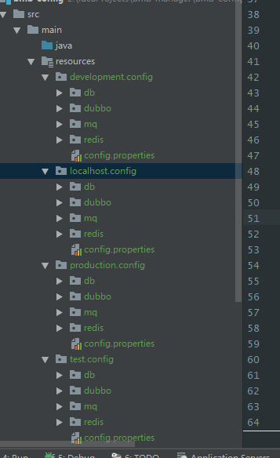
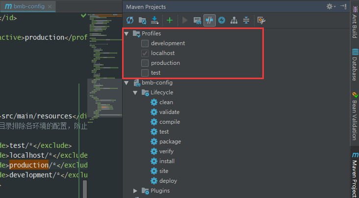

- [摘自](https://www.jianshu.com/p/8a6e3b7dd939)

在平常开发的过程中，我们的项目配置文件经常有有几套分别对应自己本地的环境、开发环境、测试环境、以及生产环境。因为在不同的环境中项目的相关配置也会有相关的不同，我们在不同的环境中部署就要手动修改为对应环境的配置，这样太麻烦了以及这样也会很容易出错。\
目前JAVA相关的项目基本都是使用Maven来进行构建。在maven中实现多环境的构建可移植性需要使用profile，通过不同的环境激活不同的profile来达到构建的可移植性。\
接下来我们就通过maven的相关配置来在打包时指定各个环境对应配置文件。
### 第一步 pom文件中的profile
首先时pom文件中profile配置
```xml
<!-- 定义打包环境变量，本地环境，生产环境；测试环境；开发环境 -->
<profiles>
    <profile>
        <!-- 本地开发环境 -->
        <id>localhost</id>
        <properties>
            <profiles.active>localhost</profiles.active>
        </properties>
        <activation>
            <activeByDefault>true</activeByDefault>
        </activation>
    </profile>
    <profile>
        <!-- 开发环境 -->
        <id>development</id>
        <properties>
            <profiles.active>development</profiles.active>
        </properties>
    </profile>
    <profile>
        <!-- 测试环境 -->
        <id>test</id>
        <properties>
            <profiles.active>test</profiles.active>
        </properties>
    </profile>
    <profile>
        <!-- 生产环境 -->
        <id>production</id>
        <properties>
            <profiles.active>production</profiles.active>
        </properties>
    </profile>
</profiles>
```

在pom文件中添加以上的配置信息，来区分本地环境，目录、开发环境目录、测试环境目录以及生产环境目录。\
其中localhost的节点，我们设置了
```xml
<activation>
    <activeByDefault>true</activeByDefault>
</activation>
```
这里是设置本地的环境是默认激活的，如果我们在打包时不指定相关的文件，项目就默认指定本地的配置文件了。其中profiles.active表示被激活的profile的配置文件的目录。

### 第二步 工程目录建立对应目录
因为maven的配置文件一般都是在src/main/resource目录下，所以我们在resource目录下面分别新建localhost、development、test、production这四个文件目录；如下图：


pom文件中设置build配置
```xml
<build>
    <resources>
        <resource>
            <directory>src/main/resources</directory>
            <!-- 资源根目录排除各环境的配置，防止在生成目录中多余其它目录 -->
            <excludes>
                <exclude>test/*</exclude>
                <exclude>localhost/*</exclude>
                <exclude>production/*</exclude>
                <exclude>development/*</exclude>
            </excludes>
        </resource>
        <resource>
            <directory>src/main/resources/${profiles.active}</directory>
        </resource>
    </resources>
</build>
```

各个环境的配置我们在第二个节点中通过前面在profile中配置的profiles.active属性来指定。即src/main/resources/${profiles.active}。这样在激活指定的profile时，会加载指定目录下的配置文件，如当前激活的是pro profile，那么这个资源目录就是src/main/resources/pro。这样就达到了不同环境加载不同配置的目的。\

### 第三步 项目编译
通过在运行maven命令时指定不同的profile即可构建不同环境需要的war包或发布到不同的环境了 。如：
```xml
mvn clean package -Pproduction
```

这样我们就是打包生产环境的配置了。\
如果我们是idea开发的话，我们可以不用些命令的方式\
我们打开idea的maven窗口。



我们这里可以勾选不同的配置环境来打包对应的环境配置文件。


