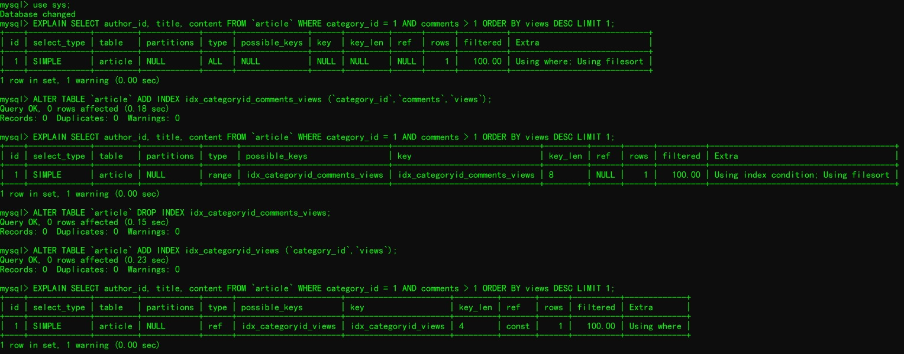

```markdown

1.前导模糊查询不能使用索引。
例如下面 SQL 语句不能使用索引。
select * fromdoc where title like '%XX'
而非前导模糊查询则可以使用索引，如下面的 SQL 语句。
select * fromdoc where title like 'XX%'
页面搜索严禁左模糊或者全模糊，如果需要可以用搜索引擎来解决。

2.union、in、or 都能够命中索引，建议使用 in。
union：能够命中索引。
示例代码如下：
select * fromdoc where status=1
unionall
select * fromdoc where status=2
直接告诉 MySQL 怎么做，MySQL 耗费的 CPU 最少，但是一般不这么写 SQL。
in：能够命中索引。
示例代码如下：
select * fromdoc where status in (1, 2)
查询优化耗费的 CPU 比 union all 多，但可以忽略不计，一般情况下建议使用 in
or：新版的 MySQL 能够命中索引。
示例代码如下：
select * fromdoc where status = 1 or status = 2
查询优化耗费的 CPU 比 in 多，不建议频繁用 or。

3.负向条件查询不能使用索引，可以优化为 in 查询。
负向条件有：!=、<>、not in、not exists、not like 等。
例如下面代码：
select * fromdoc where status != 1 and status != 2
可以优化为 in 查询：
select * fromdoc where status in (0,3,4)

4.联合索引最左前缀原则（又叫最左侧查询）
如果在(a,b,c)三个字段上建立联合索引，那么它能够加快 a | (a,b) | (a,b,c) 三组查询速度。
例如登录业务需求，代码如下。
select uid, login_time from user where login_name=? and passwd=?
可以建立(login_name, passwd)的联合索引。
因为业务上几乎没有 passwd 的单条件查询需求，而有很多 login_name 的单条件查询需求，所以可以建立(login_name, passwd)的联合索引，而不是(passwd, login_name)。
建联合索引的时候，区分度最高的字段在最左边。
如果建立了(a,b)联合索引，就不必再单独建立 a 索引。同理，如果建立了(a,b,c)联合索引，就不必再单独建立 a、(a,b) 索引。
存在非等号和等号混合判断条件时，在建索引时，请把等号条件的列前置。如     where a>? and b=?，那么即使 a 的区分度更高，也必须把 b 放在索引的最前列。
最左侧查询需求，并不是指 SQL 语句的 where 顺序要和联合索引一致。
下面的 SQL 语句也可以命中 (login_name, passwd) 这个联合索引。
selectuid, login_time from user where passwd=? andlogin_name=?
但还是建议 where 后的顺序和联合索引一致，养成好习惯。

5.范围列可以用到索引（联合索引必须是最左前缀）。
范围条件有：<、<=、>、>=、between等。
范围列可以用到索引（联合索引必须是最左前缀），但是范围列后面的列无法用到索引，索引最多用于一个范围列，如果查询条件中有两个范围列则无法全用到索引。
假如有联合索引 (empno、title、fromdate)，那么下面的 SQL 中 emp_no 可以用到索引，而 title 和 from_date 则使用不到索引。
select * from employees.titles where emp_no < 10010' and title='Senior Engineer'and from_date between '1986-01-01' and '1986-12-31'

6.把计算放到业务层而不是数据库层。
在字段上进行计算不能命中索引。
例如下面的 SQL 语句。
select * from doc where YEAR(create_time) <= '2016'
即使 date 上建立了索引，也会全表扫描，可优化为值计算，如下：
select * from doc where create_time <= '2016-01-01'
把计算放到业务层。
这样做不仅可以节省数据库的 CPU，还可以起到查询缓存优化效果。
比如下面的 SQL 语句：
select * from order where date < = CURDATE()
可以优化为：
select * from order where date < = '2018-01-2412:00:00'
优化后的 SQL 释放了数据库的 CPU 多次调用，传入的 SQL 相同，才可以利用查询缓存。

7.强制类型转换会全表扫描
如果 phone 字段是 varchar 类型，则下面的 SQL 不能命中索引。
 select * fromuser where phone=13800001234
可以优化为：
select * fromuser where phone='13800001234'

8.更新十分频繁、数据区分度不高的字段上不宜建立索引。
更新会变更 B+ 树，更新频繁的字段建立索引会大大降低数据库性能。
“性别”这种区分度不大的属性，建立索引是没有什么意义的，不能有效过滤数据，性能与全表扫描类似。
一般区分度在80%以上的时候就可以建立索引，区分度可以使用 count(distinct(列名))/count(*) 来计算。

9.利用覆盖索引来进行查询操作，避免回表。
被查询的列，数据能从索引中取得，而不用通过行定位符 row-locator 再到 row 上获取，即“被查询列要被所建的索引覆盖”，这能够加速查询速度。
例如登录业务需求，代码如下。
select uid, login_time from user where login_name=? andpasswd=?
可以建立(login_name, passwd, login_time)的联合索引，由于 login_time 已经建立在索引中了，被查询的 uid 和 login_time 就不用去 row 上获取数据了，从而加速查询。

10.如果有 order by、group by 的场景，请注意利用索引的有序性。
order     by 最后的字段是组合索引的一部分，并且放在索引组合顺序的最后，避免出现     file_sort 的情况，影响查询性能。
例如对于语句 where a=? and b=? order by     c，可以建立联合索引(a,b,c)。
如果索引中有范围查找，那么索引有序性无法利用，如 WHERE     a>10 ORDER BY b;，索引(a,b)无法排序。

11.使用短索引（又叫前缀索引）来优化索引。
前缀索引，就是用列的前缀代替整个列作为索引 key，当前缀长度合适时，可以做到既使得前缀索引的区分度接近全列索引，同时因为索引 key 变短而减少了索引文件的大小和维护开销，可以使用 count(distinct left(列名, 索引长度))/count(*) 来计算前缀索引的区分度。
前缀索引兼顾索引大小和查询速度，但是其缺点是不能用于 ORDER BY 和 GROUP BY 操作，也不能用于覆盖索引（Covering Index，即当索引本身包含查询所需全部数据时，不再访问数据文件本身），很多时候没必要对全字段建立索引，根据实际文本区分度决定索引长度即可。
例如对于下面的 SQL 语句：
SELEC * FROM employees.employees WHERE first_name='Eric'AND last_name='Anido';
我们可以建立索引：(firstname, lastname(4))。

12.建立索引的列，不允许为 null。
单列索引不存 null 值，复合索引不存全为 null 的值，如果列允许为 null，可能会得到“不符合预期”的结果集，所以，请使用 not null 约束以及默认值。

13.利用延迟关联或者子查询优化超多分页场景。
MySQL 并不是跳过 offset 行，而是取 offset+N 行，然后返回放弃前 offset 行，返回 N 行，那当 offset 特别大的时候，效率就非常的低下，要么控制返回的总页数，要么对超过特定阈值的页数进行 SQL 改写。
示例如下，先快速定位需要获取的 id 段，然后再关联:
select a.* from 表1 a,(select id from 表1 where 条件 limit 100000,20 ) b where a.id=b.id

14.业务上具有唯一特性的字段，即使是多个字段的组合，也必须建成唯一索引。
不要以为唯一索引影响了 insert 速度，这个速度损耗可以忽略，但提高查找速度是明显的。另外，即使在应用层做了非常完善的校验控制，只要没有唯一索引，根据墨菲定律，必然有脏数据产生。

15.超过三个表最好不要 join。
需要 join 的字段，数据类型必须一致，多表关联查询时，保证被关联的字段需要有索引。

16.如果明确知道只有一条结果返回，limit 1 能够提高效率。
比如如下 SQL 语句：
select * from user where login_name=?
可以优化为：
select * from user where login_name=? limit 1
自己明确知道只有一条结果，但数据库并不知道，明确告诉它，让它主动停止游标移动。

17.SQL 性能优化 explain 中的 type：至少要达到 range 级别，要求是 ref 级别，如果可以是 consts 最好。
consts：单表中最多只有一个匹配行（主键或者唯一索引），在优化阶段即可读取到数据。
ref：使用普通的索引（Normal Index）。
range：对索引进行范围检索。
当 type=index 时，索引物理文件全扫，速度非常慢。

18.单表索引建议控制在5个以内。

19.单索引字段数不允许超过5个。
字段超过5个时，实际已经起不到有效过滤数据的作用了。

20.创建索引时避免以下错误观念
索引越多越好，认为一个查询就需要建一个索引。
宁缺勿滥，认为索引会消耗空间、严重拖慢更新和新增速度。
抵制惟一索引，认为业务的惟一性一律需要在应用层通过“先查后插”方式解决。
过早优化，在不了解系统的情况下就开始优化。


【问题详解】
这部分，我将列出平时会遇到的一些问题，并给予解答。
1. 请问如下三条 SQL 该如何建立索引？
where a=1and b=1
where b=1
where b=1order by time desc
MySQL 的查询优化器会自动调整 where 子句的条件顺序以使用适合的索引吗？
回答： 
第一问：建议建立两个索引，即 idxab(a,b) 和 idxbtime(b,time)。
第二问：MySQL 的查询优化器会自动调整 where 子句的条件顺序以使用适合的索引，对于上面的第一条 SQL，如果建立索引为 idxba(b,a) 也是可以用到索引的，不过建议 where 后的字段顺序和联合索引保持一致，养成好习惯。

2.假如有联合索引(empno、title、fromdate)，下面的 SQL 是否可以用到索引，如果可以的话，会使用几个列？
select * from employees.titles where emp_no between '10001' and'10010' and title='Senior Engineer' and from_date between '1986-01-01'and '1986-12-31'
回答：
可以使用索引，可以用到索引全部三个列，这个 SQL 看起来是用了两个范围查询，但作用于 empno 上的“between”实际上相当于“in”，也就是说 empno 实际是多值精确匹配，在 MySQL 中要谨慎地区分多值匹配和范围匹配，否则会对 MySQL 的行为产生困惑。

3.既然索引可以加快查询速度，那么是不是只要是查询语句需要，就建上索引？
回答：
不是，因为索引虽然加快了查询速度，但索引也是有代价的。索引文件本身要消耗存储空间，同时索引会加重插入、删除和修改记录时的负担。另外，MySQL 在运行时也要消耗资源维护索引，因此索引并不是越多越好。一般两种情况下不建议建索引。第一种情况是表记录比较少，例如一两千条甚至只有几百条记录的表，没必要建索引，另一种是数据的区分度比较低，可以使用 count(distinct(列名))/count(*) 来计算区分度。

4.主键和聚集索引的关系？
回答：
在 MySQL 中，InnoDB 引擎表是（聚集）索引组织表（Clustered IndexOrganize Table)，它会先按照主键进行聚集，如果没有定义主键，InnoDB 会试着使用唯一的非空索引来代替，如果没有这种索引，InnoDB 就会定义隐藏的主键然后在上面进行聚集。由此可见，在 InnoDB 表中，主键必然是聚集索引，而聚集索引则未必是主键。MyISAM 引擎表是堆组织表（Heap Organize Table)，它没有聚集索引的概念。

5.一个6亿的表 a，一个3亿的表 b，通过外键 tid 关联，如何最快的查询出满足条件的第50000到第50200中的这200条数据记录？
回答：方法一：如果 a 表 tid 是自增长，并且是连续的，b表的id为索引。SQL语句如下。
select * from a,b where a.tid = b.id and a.tid>500000 limit200;
方法二：如果 a 表的 tid 不是连续的，那么就需要使用覆盖索引，tid 要么是主键，要么是辅助索引，b 表 id 也需要有索引。SQL语句如下。
select * from b, (select tid from a limit 50000,200) a where b.id = a.tid;

6.假如建立联合索引(a,b,c)，下列语句是否可以使用索引，如果可以，使用了那几列？（考察联合索引最左前缀原则）
where a= 3
答：是，使用了 a 列。
where a= 3 and b = 5
答：是，使用了 a，b 列。
where a = 3 and c = 4 and b = 5
答：是，使用了 a，b，c 列。
where b= 3
答：否。
where a= 3 and c = 4
答：是，使用了 a 列。
where a = 3 and b > 10 and c = 7
答：是，使用了 a，b 列。
where a = 3 and b like 'xx%' and c = 7
答：是，使用了 a，b 列。

7.文章表的表结构如下：
CREATE TABLE IF NOT EXISTS `article` (
  `id` INT (10) UNSIGNED NOT NULL AUTO_INCREMENT,
  `author_id` INT (10) UNSIGNED NOT NULL,
  `category_id` INT (10) UNSIGNED NOT NULL,
  `views` INT (10) UNSIGNED NOT NULL,
  `comments` INT (10) UNSIGNED NOT NULL,
  `title` VARBINARY (255) NOT NULL,
  `content` TEXT NOT NULL,
  PRIMARY KEY (`id`)
) ;

下面语句应该如何建立索引？
SELECT author_id, title, content FROM `article`
WHERE category_id = 1 AND comments > 1
ORDER BY views DESC LIMIT 1;
回答：
见下图
由此可见，可以创建 idx_categoryid_views(category_id,views) 联合索引。

```
