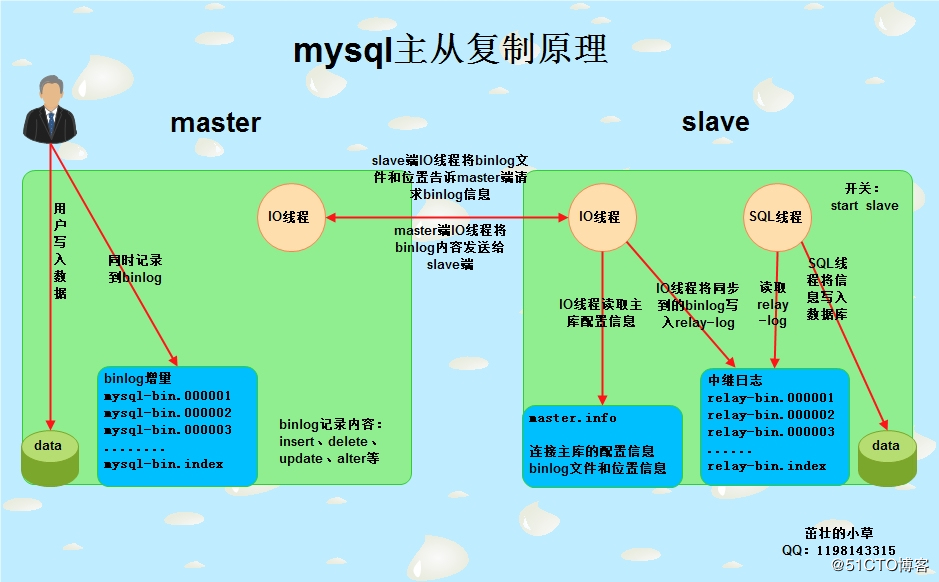

- [转自](http://blog.51cto.com/wn2100/2049534)
### 1.开启&关闭MySQL服务

```
service mysqld start

/init.d/mysqld start

safe_mysql &
```
关闭mysql服务

```
service mysqld stop

/etc/init.d/mysqld stop

mysqladmin -uroot -p123456 shutdown
```

### 2.检测端口是否运行
```markdown
lsof -i:3306

netstat -tunlp|grep 3306

ss -tulnp|grep 3306
```

### 3.为MySQL设置密码或者修改密码。
方法一
> mysqladmin -u root -p123456 password 'abc123'    #比较常用

方法二（sql语句修改）
> update mysql.user set password=password(123456) where user='root' and host='localhost';\
flush privileges;

方法三（sql语句修改）
> set password=password('abc123');

### 4.登陆MySQL数据库。

单实例登陆\
mysql -uroot -p123456

多实例登陆\
mysql -uroot -p123456 -S /data/3306/mysql.sock

### 5.查看当前数据库的字符集
```sql
mysql> show variables like '%charac%';
+--------------------------+---------------------------------------------------------+
| Variable_name            | Value                                                   |
+--------------------------+---------------------------------------------------------+
| character_set_client     | utf8                                                    |
| character_set_connection | gbk                                                     |
| character_set_database   | utf8                                                    |
| character_set_filesystem | binary                                                  |
| character_set_results    | gbk                                                     |
| character_set_server     | utf8                                                    |
| character_set_system     | utf8                                                    |
| character_sets_dir       | C:\Program Files\MySQL\MySQL Server 5.7\share\charsets\ |
+--------------------------+---------------------------------------------------------+
```

### 6. 查看当前数据库版本
```sql
C:\Users\Administrator>mysql -V
mysql  Ver 14.14 Distrib 5.7.18, for Win64 (x86_64)
```
```sql
mysql> select version();
+------------+
| version()  |
+------------+
| 5.7.18-log |
+------------+
```
### 7.查看当前登录的用户。
```sql
mysql> select user();
+----------------+
| user()         |
+----------------+
| root@localhost |
+----------------+
```

### 8.创建GBK字符集的数据库oldboy，并查看已建库完整语句
```sql
mysql> create database oldboy default character set gbk;
Query OK, 1 row affected (0.03 sec)

mysql> show create database oldboy;
+----------+----------------------------------------------------------------+
| Database | Create Database                                                |
+----------+----------------------------------------------------------------+
| oldboy   | CREATE DATABASE `oldboy` /*!40100 DEFAULT CHARACTER SET gbk */ |
+----------+----------------------------------------------------------------+
1 row in set (0.00 sec)
```

### 9.创建用户oldboy，使之可以管理数据库oldboy
```sql
mysql> grant select,update,insert,delete,alter on oldboy.* to oldboy@'localhost' identified by '123456';
Query OK, 0 rows affected, 1 warning (0.08 sec)
```

### 10.查看创建的用户oldboy拥有哪些权限
```sql
mysql> show grants for oldboy@'localhost';
+-----------------------------------------------------------------------------------+
| Grants for oldboy@localhost                                                       |
+-----------------------------------------------------------------------------------+
| GRANT USAGE ON *.* TO 'oldboy'@'localhost'                                        |
| GRANT SELECT, INSERT, UPDATE, DELETE, ALTER ON `oldboy`.* TO 'oldboy'@'localhost' |
+-----------------------------------------------------------------------------------+
2 rows in set (0.02 sec)
```

### 11.查看当前数据库里有哪些用户
```sql
mysql> select user,host from mysql.user;
+-----------+-----------+
| user      | host      |
+-----------+-----------+
| esx       | %         |
| mysql.sys | localhost |
| oldboy    | localhost |
| root      | localhost |
+-----------+-----------+
4 rows in set (0.00 sec)
```

### 12.   进入oldboy数据库
```sql
mysql> use oldboy;
Database changed
```

### 13.   创建一个innodb GBK表test，字段id int(4)和name varchar(16)
### 14.   查看建表结构及表结构的SQL语句
### 15.   插入一条数据“1,oldboy”
### 16.   再批量插入2行数据 “2,老男孩”，“3,oldboyedu”
### 17.   查询名字为oldboy的记录
### 18.   把数据id等于1的名字oldboy更改为oldgirl
### 19.   在字段name前插入age字段，类型tinyint(2)
```sql
mysql> create table test (id int(4),name varchar(16)) engine=InnoDB default charset=gbk;
Query OK, 0 rows affected (0.71 sec)

mysql> desc test;
+-------+-------------+------+-----+---------+-------+
| Field | Type        | Null | Key | Default | Extra |
+-------+-------------+------+-----+---------+-------+
| id    | int(4)      | YES  |     | NULL    |       |
| name  | varchar(16) | YES  |     | NULL    |       |
+-------+-------------+------+-----+---------+-------+
2 rows in set (0.00 sec)

mysql> show create table test\G;
*************************** 1. row ***************************
       Table: test
Create Table: CREATE TABLE `test` (
  `id` int(4) DEFAULT NULL,
  `age` tinyint(2) DEFAULT NULL,
  `name` varchar(16) DEFAULT NULL
) ENGINE=InnoDB DEFAULT CHARSET=gbk
1 row in set (0.00 sec)

ERROR:
No query specified

mysql> insert into test (id,name) values (1,'oldboy');
Query OK, 1 row affected (0.04 sec)

mysql> insert into test (id,name) values (2,'老男孩'),(3,'oldboyedu');
Query OK, 2 rows affected, 1 warning (0.05 sec)
Records: 2  Duplicates: 0  Warnings: 1

mysql> select * from test where name='oldboy';
+------+--------+
| id   | name   |
+------+--------+
|    1 | oldboy |
+------+--------+
1 row in set (0.09 sec)

mysql> update test set name='oldgirl' where id=1;
Query OK, 1 row affected (0.07 sec)
Rows matched: 1  Changed: 1  Warnings: 0

mysql> alter table test add age tinyint(2) after id;
Query OK, 0 rows affected (0.92 sec)
Records: 0  Duplicates: 0  Warnings: 0

mysql> select * from test;
+------+------+-----------+
| id   | age  | name      |
+------+------+-----------+
|    1 | NULL | oldgirl   |
|    2 | NULL | 老男孩    |
|    3 | NULL | oldboyedu |
+------+------+-----------+
3 rows in set (0.00 sec)
```
### 20.   不退出数据库,完成备份oldboy数据库

mysql> system mysqldump -uroot -p123456 -B -x -F --events oldboy >/opt/bak.sql

### 21.   删除test表中的所有数据，并查看

mysql> delete from test;

### 22.   删除表test和oldboy数据库并查看

mysql> drop table test;\
mysql> drop database oldboy;

### 23.   不退出数据库恢复以上删除的数据

mysql> system mysql -uroot -p123456 </opt/bak.sql   

### 24.   把库表的GBK字符集修改为UTF8

mysql> alter database oldboy default character set utf8;\
mysql> alter table test default character set utf8;

### 25.   把id列设置为主键，在Name字段上创建普通索引。
mysql> alter table test add primary key(id);\
方法一：\
mysql> alter table test add index index_name(name);\
方法二：\
mysql> create index index_name on test(name);

### 26.   在字段name后插入手机号字段(shouji)，类型char(11)。
mysql> alter table test add shouji char(11) after name;

### 27.   所有字段上插入2条记录（自行设定数据）
mysql> insert into test (id,age,name,shouji) values ('4','27','wangning','13833573773');\
mysql> insert into test (id,age,name,shouji) values ('5','30','litao','13833573773');

### 28.在手机字段上对前8个字符创建普通索引
方法一：\
mysql> alter table test add index index_shouji(shouji(8));\
方法二：\
mysql> create index index_shouji on test(shouji(8));

### 29.查看创建的索引及索引类型等信息。
mysql> show index from test\G

### 30.删除Name，shouji列的索引。
mysql> alter table test drop index index_name;\
mysql> alter table test drop index index_shouji;

### 31.对Name列的前6个字符以及手机列的前8个字符组建联合索引。
mysql> create index index_name_shouji on test(name(6),shouji(8));

### 32.查询手机号以135开头的，名字为oldboy的记录（提前插入）。
mysql> select * from test where name='oldboy' and shouji like "135%";

### 33.查询上述语句的执行计划（是否使用联合索引等）。
mysql> explain select * from test where name="oldboy" and shouji like "135%"\G

### 34.把test表的引擎改成MyISAM。
mysql> alter table test engine=myisam;     #myisam不区分大小写

### 35.收回oldboy用户的select权限。
mysql> revoke select on oldboy.* from oldboy@'localhost';

### 36.删除oldboy用户。
mysql> drop user oldboy@'localhost';

### 37.删除oldboy数据库。
mysql> drop database oldboy;

### 38.使用mysqladmin关闭数据库。
mysqladmin -uroot -p123456 shutdown

### 39.MySQL密码丢了，请找回？
```sql
pkill mysql               #先关闭mysql服务
使用--skip-grant-tables启动mysql，忽略授权登陆验证
mysqld_safe --defaults-file=/etc/my.cnf --skip-grant-tables &
mysql #此时再登陆，已经不需要密码了
mysql> update mysql.user set password=password('abc123') where user='root' and host="localhost";            #设置新的密码
mysql> flush privileges;
mysql -uroot -pabc123     #再次用新设置的密码登陆即可
```

### 40.请解释关系型数据库概念及主要特点？
概念：关系型数据库是支持采用了关系模型的数据库，简单来说，关系模型就是指二维表模型，而一个关系数据库就是由二维表及其之间的联系所组成的一个数据组织。\
特点：最大的特点就是事务的一致性。\
优点：容易理解、使用方便、易于维护、支持SQL。
缺点：
1.高并发读写需求：网站的用户并发非常高，往往达到每秒上万次读写请求，对于传统关系型数据库来说，硬盘I/O是一个很大的瓶颈。\
2.海量数据的高效读写：对于数据量巨大的网站来说，关系型数据库的查询效率非常低。\
3.固定的表结构。

### 41.请说出关系型数据库的典型产品、特点及应用场景？
**1.SQLserver**\
特点：真正的客户机/服务器体系结构\
      图形化用户界面\
      丰富的编程接口工具\
      与Windows NT完全集成\
      具有很好的伸缩性\
应用场景：\
主机为Windows系统，主要应用于web网站的建设，承载中小型web后台数据。

**2.MySQL**\
特点：体积小，总拥有成本低，开放源代码，可运行在多数系统平台上，轻量级易扩展。\
应用场景：广泛的应用在Internet上的中小型网站中。

**3.Oracle**\
特点：跨平台运行，安全性方面，性能最高。对硬件要求高，价格昂贵。\
应用场景：大部分国企事业单位都用Oracle，在电信行业占用最大的份额。

### 42.请解释非关系型数据库概念及主要特点？
1.使用键值对存储数据，且结构不固定\
2.一般不支持ACID特性。\
3.基于键值对，数据没有耦合性，容易扩展。\
4.不提供SQL支持，学习和使用成本较高。

### 43.请说出非关系型数据库的典型产品、特点及应用场景？
**MongoDB**\
特点：1.高性能，易部署，易使用。\
      2.面向集合存储，易存储对象类型的数据。\
      3.模式自由\
      4.自动处理碎片，以支持云计算层次的扩展性。

应用场景：\
      网站数据：mongodb非常适合实时的插入，更新与查询。\
      缓存：适合作为信息基础设施的缓存层\
      大尺寸、低价值的数据\
      高伸缩性的场景

**Redis**\
特点：1.性能极高，能支持超过100k+每秒的读写频率\
      2.丰富的数据类型\
      3.所有操作都是原子性的

使用场景：\
      少量的数据存储，高速读写访问

**SQLlite**\
特点：\
1.嵌入式的，零配置，无需安装和管理配置\
2.ACID事务\
3.存储在单一磁盘文件中的一个完整的数据库。\

应用场景：\
1.需要数据库的小型桌面软件。\
2.需要数据库的手机软件。\
3.作为数据容器的应用场景。

### 44.请详细描述SQL语句分类及对应代表性关键字。
（1）DDL(Data Definition Language)---数据库定义语言（create、alter、drop)，管理基础数据库，例如：库，表\
（2）DCL(Data Control Language)---数据控制语言（grant、revoke、commit、rollback），用户授权，权限回收，数据提交回滚等\
（3）DML（Data Manipulation Language)---数据操作语言（select、insert、delete、update）,针对数据库里的表，记录  

### 45.请详细描述char(4)和varchar(4)的差别。
char(4)定义的是固定长度4，存储时，如果字符数不够4位，会在后面用空格补全存入数据库。\
varchar(4)定义的是变长长度，存储时，如果字符没有达到定义的位数4时，也不会在后面补空格。

### 46.如何授权oldboy用户从172.16.1.0/24访问数据库。
mysql> grant all on *.* to oldboy@'172.16.1.%' identified by '123456';

### 47.什么是MySQL多实例，如何配置MySQL多实例？
在一台服务器上，mysql服务开启多个不同的端口，运行多个服务进程，这些mysql服务进程通过不同的socket来监听不同的数据端口，进而互不干涉的提供各自的服务。

### 48.如何加强MySQL安全，请给出可行的具体措施？
1.避免直接从互联网访问mysql数据库，确保特定主机才拥有访问权限。\
2.定期备份数据库\
3.禁用或限制远程访问\
在my.cnf文件里设置bind-address指定ip\
4.移除test数据库（默认匿名用户可以访问test数据库）\
5.禁用local infile\
mysql> select load_file("/etc/passwd");\
在my.cnf里[mysqld]下添加set-variable=local-infile=0\
6.移除匿名账户和废弃的账户\
7.限制mysql数据库用户的权限\
8.移除和禁用.mysql_history文件\
cat ~/.mysql_history\
export MYSQL_HISTFILE=/dev/null\ 

### 49.delete和truncate删除数据的区别？
truncate table test执行更快，清空物理文件，清空表中的所有内容\
delete from test是逻辑删除，按行删除，而且可以通过where语句选择要删除的行

### 50.MySQL Sleep线程过多如何解决？
mysql> show processlist\G\
mysqladmin -uroot -p123456 processlist\
修改my.cnf文件里的wait_timeout的值，让其更小一些，默认wait_timeout =28800，这里改为100\
mysql> set global wait_timeout=100;\
mysql> show global variables like "wait_timeout"; 

### 51.sort_buffer_size参数作用？如何在线修改生效？
mysql执行排序使用的缓冲大小。如果想要增加order by的速度，首先看是否可以让mysql使用索引而不是额外的排序阶段，如果不能，可以尝试增加sort_buffer_size变量的大小。\
mysql> set global sort_buffer_size =131072;    #单位为B，即128KB，默认64K 

### 52.如何在线正确清理MySQL binlog？
自动清除\
mysql> set global expire_logs_days=30;   #设置binlog过期时间为30天\
手动清除\
mysql> purge binary logs to "mysql-bin.000007";    #/删除mysql-bin.000007之前的所有binlog日志

### 53.Binlog工作模式有哪些？各什么特点，企业如何选择？
1.row level行级模式\
优点：记录数据详细（每行），主从一致\
缺点：占用大量的磁盘空间，降低了磁盘的性能\
2.statement level模式（默认）\
优点：记录的简单，内容少 ，节约了IO，提高性能\
缺点：导致主从不一致\
3.MIXED混合模式\
结合了statement和row模式的优点，会根据执行的每一条具体的SQL语句来区分对待记录的日志形式。对于函数，触发器，存储过程会自动使用row level模式

企业场景选择：\
1.互联网公司使用mysql的功能较少（不用存储过程、触发器、函数），选择默认的statement模式。\
2.用到mysql的特殊功能（存储过程、触发器、函数）则选则MIXED模式\
3.用到mysql的特殊功能（存储过程、触发器、函数），有希望数据最大化一致则选择row模式。 

### 54.误操作执行了一个drop库SQL语句，如何完整恢复？

如果条件允许，操作前最好禁止外面一切服务器访问mysql数据库，这里假设禁止外面访问数据库，具体步骤如下：\
1.手动切割binlog日志并记好切割好的binlog日志文件位置，这里假设为009，备份全部binlog日志\
2.找到之前全备数据最后备份到的binlog文件位置并记好位置，这几假设为005\
3.用mysqladmin命令将005到008binlog文件中的SQL语句分离出来，并找到drop库的语句将其删掉\
4.将之前全备数据导入mysql服务器\
5.将步骤3中分离出的SQL语句导入mysql服务器\
6.将009binlog文件删除，再次刷新binlog日志，到此数据库已恢复成功。

### 55.mysqldump备份使用了-A -B参数，如何实现恢复单表？
1.先用sed或awk将全库中的需要的表结构过滤出来\
sed -e '/./{H;$!d;}' -e 'x;/CREATE TABLE `SC`/!d;q' /opt/bak_2017-12-07.sql\
2.再用grep将全库中相应的表内容过滤出来\
grep 'INSERT INTO `SC`' /opt/bak_2017-12-07.sql\
3.将1和2中过滤出来的SQL语句导入数据库即可

### 56.详述MySQL主从复制原理及配置主从的完整步骤。

主从复制原理：\


1.主：binlog线程，记录所有改变了数据库数据的语句，放进master上的binlog中\
2.从：IO线程，在使用start slave之后，负责从master上拉取binlog内容，放进自己的relay log中\
3.从：SQL执行线程，执行relay log中的语句。\
配置步骤：\
1.主库开启binlog日志功能\
2.全备数据库，记录好binlog文件和相应的位置\
3.从库上配置和主库的连接信息\
4.将全备数据导入从库\
5.从库启动slave\
6.在从库上查看同步状态，确认是否同步成功

### 57.如何开启从库的binlog功能？
在my.cnf文件中写入log-bin=mysql-bin

### 58.MySQL如何实现双向互为主从复制，并说明应用场景?
两台数据库都开启binlog功能，相互为主从配置。\
双主的实现方式主要有两种：\
1.让表的ID自增，然后主1写1、3、5，主2写2、4、6\
2.不让表的ID自增，然后通过web端程序去seq服务器取ID，写入双主。\
双主工作场景为高并发写的场景，慎用。 

### 59.MySQL如何实现级联同步，并说明应用场景?
第一台数据库开启binlog功能设为主服务器，第二台数据库也开启binlog功能，设为第一台服务器的从服务器，设为其他数据库的主服务器

### 60.MySQL主从复制故障如何解决？
解决办法1：\
登陆从库上操作：\
1.stop slave 临时停止同步开关\
2.set global sql_slave_skip_counter=1，将同步指针向下移动一个，也可以多个，如果多次不同步，可以重复操作。\
3.start slave，重启主从复制开关

解决办法2：\
在my.cnf配置文件中加入参数\
slave-skip-errors=1032,1062,1007 

### 61.如何监控主从复制是否故障?
查看slave端的IO和SQL进程状态是否OK，同步延迟时间是否小于1分钟\
mysql> show slave status\G\
Slave_IO_Running: Yes\
Slave_SQL_Running: Yes\
Seconds_Behind_Master: 0 

### 62.MySQL数据库如何实现读写分离？
1.通过程序实现读写分离（性能，效率最佳，推荐PHP和Java程序都可以通过设置多个连接文件轻松的实现对数据库的读写分离，即当select时，就去连接读库的连接文件，当update、insert、delete是就去连接写库的连接文件。\
2.通过软件实现读写分离MySQL-proxy,Amoeba等代理软件也可以实现读写分离功能，但最常用最好用的还是程序实现读写分离。\
3.开发dbproxy

### 63.生产一主多从从库宕机，如何手工恢复？
处理方法：重做slave\
1.停止slave\
2.导入备份数据\
3.配置master.info信息\
4.启动slave\
5.检查从库状态

### 64.生产一主多从主库宕机，如何手工恢复？
主库宕机分为数据库宕机和服务器宕机2种，不管哪种都要进行主从切换。\
1.登陆从库检查IO线程和SQL线程状态show processlist\G，确认SQL线程已读完所有relay-log\
2.登陆所有从库检查master.info信息，查看哪个从库的binlog文件和位置是最新的，选择最新的从库切换为主库（或利用半同步功能，直接选择做了实时同步的从库为主库）\
3.如果主库只是数据库宕了，服务器还在运行，则可以把binlog拉取到提升为主库的从库应用。\
4.登陆要切换为主库的从库，进行切换操作。\
 stop slave;reset master;quit\
5.进入要切换的从库数据目录，删除master.info和relay-log.info文件，并检查授权表，read_only等参数\
6.修改my.cnf配置文件，开启binlog，注释从库参数\
log-bin=/data/3307/mysql-bin\
\#log-slave-updates\
\#read-only\
7.对同步用户进行提权，保证权限与主库用户权限一样\
8.重启数据库提生为主库\
9.其他从库操作\
（1）检查运行环境和用户\
（2）停止从库，修改master信息\
（3）启动从库同步，检查同步状态\
10.修改web程序的连接配置，从原主库指向新主库\
11.维护损坏的主库，完成后作为从库使用，或切换回来\
12.如果主库没有宕机，只是想按计划切换一下主库，就非常简单\
（1）主库锁表\
（2）登陆所有从库检查同步状态，查看是否完成同步。\
（3）其他按上面步骤进行切换

### 65.MySQL出现复制延迟有哪些原因？如何解决？
1.一个主库的从库太多，导致复制延迟\
建议从库数量3-5个为宜，要复制的从节点数量过多，会导致复制延迟\
2.从库硬件比主库差，导致复制延迟\
查看master和slave的系统配置，可能会因为机器配置问题，包括磁盘IO、CPU、内存等各方面因素造成复制的延迟，一般发生在高并发大数据量的写入场景。\
3.慢SQL语句过多\
假如一条SQL语句执行时间是20秒，那么执行完毕到从库上能查到数据也至少是20秒，可以修改后分多次写入，通过查看慢查询日志或show full processlist命令找出执行时间长的查询语句或者大的事务。\
4.主从复制设计问题\
主从复制单线程，如果主库写并发太大，来不及传送到从库就会导致延迟。更高版本的mysql可以支持多线程复制，门户网站则会自己开发多线程同步功能。\
5.主从库之间网络延迟\
主从库的网卡，网线，连接的交换机等网络设备都可能成为复制的瓶颈，导致复制延迟，另外，跨公网主从复制很容易导致主从复制延迟。\
6.主库读写压力大，导致复制延迟\
主库硬件要搞好一点，架构的前端要加buffer。

### 66.给出企业生产大型MySQL集群架构可行备份方案？
1.利用mysqldump做定时备份，根据情况可按天或按周做全库备份。\
2.用rsync+inotify对主库binlog做实时备份 

### 67.什么是数据库事务，事务有哪些特性？企业如何选择？
事务就是指逻辑上的一组SQL语句操作，组成这组操作的各个SQL语句，执行时要么全成功要么全失败。\
事务的四大特性(ACID)：
1.原子性（atomicity）\
整个事务的所有操作，要么全部完成，要么全部不完成，不可能停滞在中间某个环节。事务在执行过程中发生错误，会被回滚（rollback）到事务开始前的状态，就像这个事务从来没有执行过一样。\
2.一致性（consistency）\
事务发生前和发生后，数据的完整性必须保持一致\
3.隔离性（isolation）\
当并发访问数据库时，一个正在执行的事务在执行完毕前，对于其他的会话是不可见的，多个并发事务之间的数据是相互隔离的。\
4.持久性（durability）\
一个事务一旦被提交，它对数据库中的数据改变就是永久性的，如果出了错误，事务也不允许撤销。

### 68.   请解释全备、增备、冷备、热备概念及企业实践经验？
全备：备份数据库所有数据\
增备：一次性备份所有数据，然后再增量备份。\
冷备：需要关闭mysql服务，读写请求均不允许状态下进行。\
温备：服务在线，但仅支持读请求，不允许写请求的情况下备份。\
热备：备份的同时，业务不受影响。 

### 69.   MySQL的SQL语句如何优化？
1.在表中建立索引，优先考虑where、group by使用到的字段\
2.尽量避免使用select *，返回无用的字段会降低查询效率\
3.尽量避免使用in和not in，会导致数据库引擎放弃索引进行全表扫描\
4.尽量避免使用or，会导致数据库引擎放弃索引进行全表扫描\
5.尽量避免在字段开头模糊查询，会导致数据库引擎放弃索引进行全表扫描 

### 70.MySQL中MyISAM与InnoDB的区别，至少5点
（1）问5点不同\
a.InnoDB支持事务，而MyISAM不支持事务。\
b.InnoDB支持行级锁，而MyISAM支持表级锁\
c.InnoDB支持MVCC，而MyISAM不支持\
d.InnoDB支持外键，而MyISAM不支持\
e.InnoDB不支持全文索引，而MyISAM支持\
（2）InnoDB引擎的3大特性\
  插入缓存（insert buffer）、二次写（double write）、自适应哈希索引（ahi）、预读（read ahead）\
（3）二者select count(*)哪个更快，为什么？
 MyISAM更快，因为MyISAM内部维护了一个计数器，可以直接调取。

### 71.如何调整生产线中MySQL数据库的字符集。
1.修改my.cnf文件中的字符集配置
2.查看当前字符集设置
mysql> show global variables like "character%";
3.用set分别设置字符集变量值
```sql
mysql> set global character_set_client=utf8;
mysql> set global character_set_connection=utf8;
mysql> set global character_set_results=utf8;
mysql> set global character_set_database;
mysql> set global character_set_server;
mysql> set global character_set_system;
```
### 72.请描述MySQL里中文数据乱码原理，如何防止乱码？
mysql客户端 mysql服务端 操作系统等字符集不一致导致的乱码，将上述字符集调成一致。

### 73.企业生产MySQL如何优化（请多角度描述）？
1.硬件优化\
CPU、内存、磁盘、网卡\
2.软件优化\
（1）操作系统：64位，内核优化\
（2）MySQL编译安装、优化\
3.my.cnf里的参数优化

### 74.MySQL高可用方案有哪些，各自特点，企业如何选择？
1.主从复制+读写分离\
优点：成本低、架构简单、易实施、维护方便\
缺点：master出现问题后不能自动到slave上，需要人工干涉。\
2.MySQL Cluster\
优点：安全性高，稳定性高。可以在线增加节点\
缺点：架构复杂，至少三个节点，对于引擎只能用ndb，不支持外键，管理复杂，部署费时而且是收费的。\
3.Heartbeat /keepalived+双主从复制\
优点：安全性、稳定性高，出现故障系统将自动切换，从而保证服务的连续性。\
缺点：可能会发生脑裂\
4.HeartBeat+DRBD+MySQL\
优点：安全性、稳定性、出现故障系统将自动切换，从而保证服务的连续性。\
缺点：只用一台服务器提供服务，成本高，可能发生脑裂 

### 75.如何分表分库备份及批量恢复（口述脚本实现过程）？
备份库：\
mysqldump -u 用户名 -p 密码 数据库名  >备份的文件名\
备份表\
mysqldump -u 用户名 -p 密码 数据库名 表名 >备份的文件名\

### 76.如何批量更改数据库字符集?
```sql
#!/bin/sh
cmd="mysql -uroot -pabc123 -e"
$cmd "show databases;"|grep -v Database >/file.txt
databases=/file.txt
for n in `cat $databases`
do
   $cmd "alter database $n default character set utf8;"
done
```
### 77.网站打开慢，请给出排查方法，如是数据库慢导致，如何排查并解决，请分析并举例？
1.检查操作系统是否负载过高
2.登陆mysql查看有哪些sql语句占用时间过长，show processlist;
3.用explain查看消耗时间过长的SQL语句是否走了索引
4.对SQL语句优化，建立索引

### 78.xtranbackup的备份、增量备份及恢复的工作原理？
XtraBackup基于InnoDB的crash-recovery功能，它会复制InnoDB的data file，由于不锁表，复制出来的数据是不一致的，在恢复的时候使用crash-recovery，使得数据恢复一致。\
InnoDB维护了一个redo log，又称为transaction log（事务日志），它包含了InnoDB数据的所有改动情况。当InnoDB启动的时候，它会先去检查data file和transaction log，并且会做两步操作：\
XtraBackup在备份的时候，一页一页的复制InnoDB的数据，而且不锁定表，与此同时，XtraBackup还有另外一个线程监视着transaction log，一旦log发生变化，就把变化过的log pages复制走。为什么要着急复制走呢？因为transaction log文件大小有限，写满之后，就会从头再开始写，所以新数据可能会覆盖到旧的数据。\
在prepare过程中，XtraBackup使用复制到的transaction log对备份出来的InnoDB data file进行crash recovery 

### 79.误执行drop数据，如何通过xtrabackup恢复？
1.关闭mysql服务
2.移除mysql的data目录及数据
3.将备份的数据恢复到mysql的data目录
4.启动mysql服务

### 80.如何做主从数据一致性校验？
主从一致性校验有多种工具 例如checksum、mysqldiff、pt-table-checksum等

### 81.如何监控MySQL的增删改查次数？
```sql
mysql> show global status where variable_name in('com_select','com_insert','com_delete','com_update');
+---------------+-------+
| Variable_name | Value |
+---------------+-------+
| Com_delete    | 1     |
| Com_insert    | 17    |
| Com_select    | 638   |
| Com_update    | 2     |
+---------------+-------+
4 rows in set (0.00 sec)
```

### 82.MySQL索引的种类及工作原理。
普通索引：最基本的索引，没有任何限制。\
唯一索引：与普通索引类似，不同的是，索引列的值必须唯一，但允许有空值。\
主键索引：它是一种特殊的唯一索引，不允许有空值。一张表只能有一个主键。\
组合索引：就是将多个字段建到一个索引里。 

### 83.如何自定义脚本启动MySQL(说出关键命令)
mysqld_safe  --defaults-file=/data/3306/my.cnf  & 

### 84.如何自定义脚本平滑关闭MySQL(说出关键命令)
mysqladmin -u root-p123456 -S /data/3306/mysql.sock shutdown

### 85.你们的公司如何实现数据库读写分离的？
通过程序实现的读写分离\
insert、update、delete、alter等走主库，select等走从库

### 86.mysqldump导入导出默认把所有数据都缩减在一行里面，为了查看和修改方便，如何将数据以多行插入的形式导出。
用--skip-extend-insert选项 

### 87.你是如何监控你能数据库的？
开源监控工具有很多，如zabbix，nagios\
Lepus(天兔)：简洁、直观、强大的开源数据库监控系统，MySQL/Oracle/MongoDB/Redis一站式性能监控，让数据库监控更简单

### 88.  公司现有的数据库架构，总共有几组mysql库？
我们公司现在有两组MySQL。其中一套是生产库，一套是测试库。\
生产库和测试库都是用的mha +半同步复制做的高可用。\
我们所有的项目web前端量（大概有10个项目）指向的都是一个机器上的mysql实例。因为我们是传统行业，并发访问量并不是很大，所以目前我们的生产mysql数据库未出现性能问题。

### 89.  mysql的权限怎么管理？
只给insert,update，select和delete四个权限即可。有时候delete都不给。 

### 90.  如果发现CPU，或者IO压力很大，怎么定位问题？
1. 首先我会用top命令和iostat命令，定位是什么进程在占用cpu和磁盘io； 
2. 如果是mysql的问题，我会登录到数据库，通过show full processlist命令，看现在数据库在执行什么sql语句，是否有语句长时间执行使数据库卡住；
3. 执行show engine innodb status\G命令，查看数据库是否有锁资源争用；
4. 查看mysql慢查询日志，看是否有慢sql；
5. 找到引起数据库占用资源高的语句，进行优化，该建索引的建索引，索引不合适的删索引，或者根据情况kill掉耗费资源的sql语句等