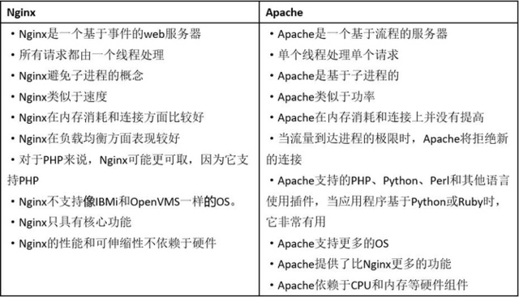

### 1、请解释一下什么是Nginx?
Nginx是一个web服务器和方向代理服务器，用于HTTP、HTTPS、SMTP、POP3和IMAP协议。

### 2、请列举Nginx的一些特性。
Nginx服务器的特性包括：
- 反向代理/L7负载均衡器
- 嵌入式Perl解释器
- 动态二进制升级
- 可用于重新编写URL，具有非常好的PCRE支持

### 3、请列举Nginx和Apache 之间的不同点。


### 4、请解释Nginx如何处理HTTP请求。
Nginx使用反应器模式。主事件循环等待操作系统发出准备事件的信号，这样数据就可以从套接字读取，在该实例中读取到缓冲区并进行处理。单个线程可以提供数万个并发连接。

### 5、在Nginx中，如何使用未定义的服务器名称来阻止处理请求?
只需将请求删除的服务器就可以定义为：
```markdown

Server {
 
listen 80;
 
server_name " " ;
 
return 444;
 
}
```

### 6、 使用“反向代理服务器”的优点是什么?
反向代理服务器可以隐藏源服务器的存在和特征。它充当互联网云和web服务器之间的中间层。这对于安全方面来说是很好的，特别是当您使用web托管服务时。

### 7、请列举Nginx服务器的最佳用途。
Nginx服务器的最佳用法是在网络上部署动态HTTP内容，使用SCGI、WSGI应用程序服务器、用于脚本的FastCGI处理程序。它还可以作为负载均衡器。

### 8、请解释Nginx服务器上的Master和Worker进程分别是什么?
- Master进程：读取及评估配置和维持
- Worker进程：处理请求

### 9、请解释你如何通过不同于80的端口开启Nginx?
为了通过一个不同的端口开启Nginx，你必须进入/etc/Nginx/sites-enabled/，如果这是默认文件，那么你必须打开名为“default”的文件。编辑文件，并放置在你想要的端口：
```markdown
Like server { listen 81; }
```

### 10、请解释是否有可能将Nginx的错误替换为502错误、503?
502 =错误网关 \
503 =服务器超载 \
有可能，但是您可以确保fastcgi_intercept_errors被设置为ON，并使用错误页面指令。
```markdown
Location / {
fastcgi_pass 127.0.01:9001;
fastcgi_intercept_errors on;
error_page 502 =503/error_page.html;
#…
}
```
### 11、在Nginx中，解释如何在URL中保留双斜线?
要在URL中保留双斜线，就必须使用merge_slashes_off;

语法:merge_slashes [on/off]

默认值: merge_slashes on

环境: http，server

### 12、请解释ngx_http_upstream_module的作用是什么?
ngx_http_upstream_module用于定义可通过fastcgi传递、proxy传递、uwsgi传递、memcached传递和scgi传递指令来引用的服务器组。

### 13、请解释什么是C10K问题?
C10K问题是指无法同时处理大量客户端(10,000)的网络套接字。

### 14、请陈述stub_status和sub_filter指令的作用是什么?
Stub_status指令：该指令用于了解Nginx当前状态的当前状态，如当前的活动连接，接受和处理当前读/写/等待连接的总数

Sub_filter指令：它用于搜索和替换响应中的内容，并快速修复陈旧的数据

### 15、解释Nginx是否支持将请求压缩到上游?
您可以使用Nginx模块gunzip将请求压缩到上游。gunzip模块是一个过滤器，它可以对不支持“gzip”编码方法的客户机或服务器使用“内容编码:gzip”来解压缩响应。

### 16、解释如何在Nginx中获得当前的时间?
要获得Nginx的当前时间，必须使用SSI模块、$date_gmt和$date_local的变量。

Proxy_set_header THE-TIME $date_gmt;

### 17、用Nginx服务器解释-s的目的是什么?
用于运行Nginx -s参数的可执行文件。

### 18、解释如何在Nginx服务器上添加模块?
在编译过程中，必须选择Nginx模块，因为Nginx不支持模块的运行时间选择。

### 19、负载均衡的几种常用方式？
分为轮询（round robin）、用户 IP 哈希（client IP）和指定权重 3 种方式，默认情况下，提供轮询作为负载均衡策略\
指定权重，即指定轮询几率，weight和访问比率成正比，用于后端服务器性能不均的情况。
```markdown
upstream backserver {
    server 192.168.0.14 weight=3;
    server 192.168.0.15 weight=7;
}
```
### 20、session不同步怎么办?
我们可以采用ip_hash指令解决这个问题，如果客户已经访问了某个服务器，当用户再次访问时，会将该请求通过哈希算法，自动定位到该服务器。\
即每个访客固定访问一个后端服务器，可以解决session的问题。\
其他办法：那就是用spring_session+redis，把session放到缓存中实现session共享
### 21、Ngnix常用配置有哪些？
```markdown
worker_processes 8; 工作进程个数
worker_connections 65535; 每个工作进程能并发处理（发起）的最大连接数（包含所有连接数）
error_log /data/logs/nginx/error.log; 错误日志打印地址
access_log /data/logs/nginx/access.log 进入日志打印地址
log_format main '$remote_addr"$request" ''$status $upstream_addr "$request_time"'; 进入日志格式
fastcgi_connect_timeout=300; #连接到后端fastcgi超时时间
fastcgi_send_timeout=300; #向fastcgi请求超时时间(这个指定值已经完成两次握手后向fastcgi传送请求的超时时间)
fastcgi_rend_timeout=300; #接收fastcgi应答超时时间，同理也是2次握手后
fastcgi_buffer_size=64k; #读取fastcgi应答第一部分需要多大缓冲区，该值表示使用1个64kb的缓冲区读取应答第一部分(应答头),可以设置为fastcgi_buffers选项缓冲区大小
fastcgi_buffers 4 64k;#指定本地需要多少和多大的缓冲区来缓冲fastcgi应答请求，假设一个php或java脚本所产生页面大小为256kb,那么会为其分配4个64kb的缓冲来缓存
fastcgi_cache TEST;#开启fastcgi缓存并为其指定为TEST名称，降低cpu负载,防止502错误发生
```
### 22、Ngnix与apache区别
- 轻量级，同样起web 服务，比apache 占用更少的内存及资源
- 抗并发，ngnix 处理请求是异步非阻塞的，而apache 则是阻塞型的，在高并发下nginx 能保持低资源低消耗高性能
- 高度模块化的设计，编写模块相对简单
- 最核心的区别在于apache是同步多进程模型，一个连接对应一个进程；nginx是异步的，多个连接（万级别）可以对应一个进程
### 23、Ngnix如何实现高并发
一个主进程，多个工作进程，每个工作进程可以处理多个请求\
每进来一个request，会有一个worker进程去处理。但不是全程的处理，处理到可能发生阻塞的地方，比如向上游（后端）服务器转发request，并等待请求返回。那么，这个处理的worker继续处理其他请求，而一旦上游服务器返回了，就会触发这个事件，worker才会来接手，这个request才会接着往下走。\
由于web server的工作性质决定了每个request的大部份生命都是在网络传输中，实际上花费在server机器上的时间片不多。这是几个进程就解决高并发的秘密所在。webserver刚好属于网络io密集型应用，不算是计算密集型。
### 24、fastcgi与cgi的区别
**cgi**:
web服务器会根据请求的内容，然后会fork一个新进程来运行外部c程序（或perl脚本...）， 这个进程会把处理完的数据返回给web服务器，最后web服务器把内容发送给用户，刚才fork的进程也随之退出。 如果下次用户还请求改动态脚本，那么web服务器又再次fork一个新进程，周而复始的进行。

**fastcgi**:
web服务器收到一个请求时，他不会重新fork一个进程（因为这个进程在web服务器启动时就开启了，而且不会退出），web服务器直接把内容传递给这个进程（进程间通信，但fastcgi使用了别的方式，tcp方式通信），这个进程收到请求后进行处理，把结果返回给web服务器，最后自己接着等待下一个请求的到来，而不是退出。
### 25、在Ngnix中，请说明Rewrite模块里break和last的区别。
last：停止执行当前这一轮的ngx_http_rewrite_module指令集，然后查找匹配改变后URI的新location；\
break：停止执行当前这一轮的ngx_http_rewrite_module指令集；
```markdown
location /test1.txt/ {
    rewrite /test1.txt/ /test2.txt break;
}
location ~ test2.txt {
    return 508;
}
```
使用break会匹配两次URL，如果没有满足项，就会停止匹配下面的location,直接发起请求www.xxx.com/test2.txt，由于不存在文件test2.txt，则会直接显示404。
使用last的话，会继续搜索下面是否有符合条件(符合重写后的/test2.txt请求)的location，匹配十次，如果十次没有得到的结果，那么就跟break一样了。返回上面的例子，/test2.txt刚好与面location的条件对应上了，进入花括号{}里面的代码执行，这里会返回508。（这里的508是我自己随便设定的）
### 26、解释重试策略
可以为每个 backend 指定最大的重试次数，和重试时间间隔。所使用的关键字是 max_fails 和 fail_timeout。如下所示：
```markdown
upstream backend {
    server backend1.example.com weight=5;
    server 54.244.56.3:8081 max_fails=3 fail_timeout=30s;
}
```
在上例中，最大失败次数为 3，也就是最多进行 3 次尝试，且超时时间为 30秒。max_fails 的默认值为 1，fail_timeout 的默认值是 10s。传输失败的情形，由 proxy_next_upstream 或 fastcgi_next_upstream 指定。而且可以使用 proxy_connect_timeout 和 proxy_read_timeout 控制 upstream 响应时间。


