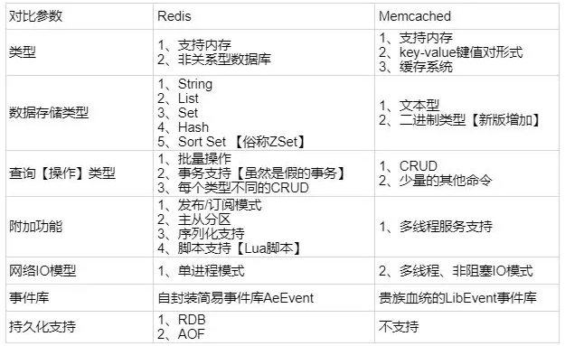

- [摘自](https://juejin.im/post/5ad6e4066fb9a028d82c4b66)
- [史上最全Redis高可用技术解决方案大全](https://mp.weixin.qq.com/s?__biz=MzU4NDQ4MzU5OA==&mid=2247484478&idx=1&sn=a1250d9b8025cd7cb6fc6a58238ab51e)
- [redis 总结——重构版](https://mp.weixin.qq.com/s?__biz=MzU4NDQ4MzU5OA==&mid=2247484450&idx=1&sn=7ee03fa67aecd05c5becd2a8259d3631)

### 1.Redis与Memcached的区别与比较
1、Redis不仅仅支持简单的k/v类型的数据，同时还提供list，set，zset，hash等数据结构的存储。memcache支持简单的数据类型，String。\
2、Redis支持数据的备份，即master-slave模式的数据备份。\
3、Redis支持数据的持久化，可以将内存中的数据保持在磁盘中，重启的时候可以再次加载进行使用,而Memecache把数据全部存在内存之中。\
4、redis的速度比memcached快很多。\
5、Memcached是多线程，非阻塞IO复用的网络模型；Redis使用单线程的IO复用模型。



### 2.Redis与Memcached的选择
1. Memcached是多线程，非阻塞IO复用的网络模型；
2. Redis使用单线程的IO复用模型；
3. 在高并发场景的压力下，多线程非阻塞式IO的Memcached表现会更加优异。                                     
4. 终极策略： 使用Redis的String类型做的事，都可以用Memcached替换，以此换取更好的性能提升； 除此以外，优先考虑Redis；

### 3.使用redis有哪些好处？
(1) 速度快，因为数据存在内存中，类似于HashMap，HashMap的优势就是查找和操作的时间复杂度都是O(1)\
(2) 支持丰富数据类型，支持string，list，set，sorted set，hash\
(3) 支持事务 ：redis对事务是部分支持的，如果是在入队时报错，那么都不会执行；在非入队时报错，那么成功的就会成功执行。\
(4) 丰富的特性：可用于缓存，消息，按key设置过期时间，过期后将会自动删除    

### 4.Redis的常见应用场景：
- 取最新N个数据的操作，如：可以将最新的50条评论的ID放在List集合
- 排行榜类的应用，取TOP N操作，前面操作以时间为权重，这个是以某个条件为权重，比如按顶的次数排序计数器应用
- 存储关系：比如社交关系，比如Tag等
- 获取某段时间所有数据排重值，使用set，比如某段时间访问的用户ID，或者是客户端IP
- 构建队列系统，List可以构建栈和队列，使用zset可以构建优先级队列
      
### 5.Redis常见数据结构使用场景   
#### 5.1 String
**常用命令: set,get,decr,incr,mget 等。**\
String数据结构是简单的key-value类型，value其实不仅可以是String，也可以是数字。\
常规key-value缓存应用； 常规计数：微博数，粉丝数等。

#### 5.2 Hash
**常用命令： hget,hset,hgetall 等。**\
Hash是一个string类型的field和value的映射表，hash特别适合用于存储对象。 \
比如我们可以Hash数据结构来存储用户信息，商品信息等等。\
比如下面我就用 hash 类型存放了我本人的一些信息：
>key=JavaUser293847
 value={
   "id": 1,
   "name": "SnailClimb",
   "age": 22,
   "location": "Wuhan, Hubei"
 }

#### 5.3 List
**常用命令: lpush,rpush,lpop,rpop,lrange等**\
list就是链表,比如微博的关注列表，粉丝列表，最新消息排行等功能都可以用Redis的list结构来实现。\
Redis list的实现为一个双向链表，即可以支持反向查找和遍历，更方便操作，不过带来了部分额外的内存开销。\
另外可以通过 lrange 命令，就是从某个元素开始读取多少个元素，可以基于 list 实现分页查询，这个很棒的一个功能，基于 redis 实现简单的高性能分页，可以做类似微博那种下拉不断分页的东西（一页一页的往下走），性能高。

#### 5.4 Set
**常用命令：sadd,spop,smembers,sunion 等**\
set对外提供的功能与list类似是一个列表的功能，特殊之处在于set是可以自动排重的。\
当你需要存储一个列表数据，又不希望出现重复数据时，set是一个很好的选择，并且set提供了判断某个成员是否在一个set集合内的重要接口，这个也是list所不能提供的。\
在微博应用中，可以将一个用户所有的关注人存在一个集合中，将其所有粉丝存在一个集合。Redis可以非常方便的实现如共同关注、共同喜好、二度好友等功能。

#### 5.5 Sorted Set
**常用命令： zadd,zrange,zrem,zcard等**\
和set相比，sorted set增加了一个权重参数score，使得集合中的元素能够按score进行有序排列。\
举例： 在直播系统中，实时排行信息包含直播间在线用户列表，各种礼物排行榜，弹幕消息（可以理解为按消息维度的消息排行榜）等信息，适合使用Redis中的SortedSet结构进行存储。

### 6.redis有哪些数据淘汰策略？
#### 6.1 删除策略
如我们一般项目中的 token 或者一些登录信息，尤其是短信验证码都是有时间限制的，放在redis中设置过期时间自动删除最合适不过。\
**redis采用定期删除+惰性删除的策略。**
- **定期删除**：redis默认是每隔 100ms 就随机抽取一些设置了过期时间的key，检查其是否过期，如果过期就删除。注意这里是随机抽取的。为什么要随机呢？你想一想假如 redis 存了几十万个 key ，每隔100ms就遍历所有的设置过期时间的 key 的话，就会给 CPU 带来很大的负载！
- **惰性删除**：定期删除可能会导致很多过期 key 到了时间并没有被删除掉。所以就有了惰性删除。假如你的过期 key，靠定期删除没有被删除掉，还停留在内存里，除非你的系统去查一下那个 key，才会被redis给删除掉。这就是所谓的惰性删除，也是够懒的哈！

但是仅仅通过设置过期时间还是有问题的。我们想一下：如果定期删除漏掉了很多过期 key，然后你也没及时去查，也就没走惰性删除，此时会怎么样？如果大量过期key堆积在内存里，导致redis内存块耗尽了。怎么解决这个问题呢？

#### 6.2 redis 内存淘汰机制
每隔一定的时间，会扫描一定数量的数据库的expires字典中一定数量的key，并清除其中已过期的key。\
可以通过设置maxmemory-policy的值来指定内存淘汰机制。
- volatile-lru：从已设置过期时间的数据集（server.db[i].expires）中挑选最近最少使用的数据淘汰
- volatile-ttl：从已设置过期时间的数据集（server.db[i].expires）中挑选将要过期的数据淘汰
- volatile-random：从已设置过期时间的数据集（server.db[i].expires）中任意选择数据淘汰
- allkeys-lru：从数据集（server.db[i].dict）中挑选最近最少使用的数据淘汰
- allkeys-random：从数据集（server.db[i].dict）中任意选择数据淘汰
- no-enviction（驱逐）：禁止驱逐数据
问题：MySQL里有2000w数据，Redis中只存20w的数据，如何保证Redis中的数据都是热点数据

### 7.Redis的并发竞争问题如何解决?
Redis为单进程单线程模式，采用队列模式将并发访问变为串行访问。Redis本身没有锁的概念，Redis对于多个客户端连接并不存在竞争，
但是在Jedis客户端对Redis进行并发访问时会发生连接超时、数据转换错误、阻塞、客户端关闭连接等问题，**这些问题均是由于客户端连接混乱造成**。\
对此有2种解决方法：
1. 客户端角度，为保证每个客户端间正常有序与Redis进行通信，**对连接进行池化，同时对客户端读写Redis操作采用内部锁synchronized**。 
2. **服务器角度，利用setnx实现锁**。\
注：对于第一种，需要应用程序自己处理资源的同步，可以使用的方法比较通俗，可以使用synchronized也可以使用lock；\
第二种需要用到Redis的setnx命令，但是需要注意一些问题。

### 8.Redis 大量数据插入

例如，如果我们需要生成一个10亿的`keyN -> ValueN’的大数据集，我们会创建一个如下的redis命令集的文件：
```$xslt
SET Key0 Value0
SET Key1 Value1
...
SET KeyN ValueN
```
使用pipe mode模式的执行命令如下：
>cat data.txt | redis-cli --pipe

这将产生类似如下的输出：
>All data transferred. Waiting for the last reply...\
Last reply received from server.\
errors: 0, replies: 1000000

### 9.Redis常见性能问题和解决方案:
1. Master最好不要做任何持久化工作，如RDB内存快照和AOF日志文件
2. 如果数据比较重要，某个Slave开启AOF备份数据，策略设置为每秒同步一次
3. 为了主从复制的速度和连接的稳定性，Master和Slave最好在同一个局域网内
4. 尽量避免在压力很大的主库上增加从库

### 10.redis 持久化机制
怎么保证 redis 挂掉之后再重启数据可以进行恢复?\
Redis不同于Memcached的很重一点就是，Redis支持持久化，而且支持两种不同的持久化操作。Redis的一种持久化方式叫快照（snapshotting，RDB）,另一种方式是只追加文件（append-only file,AOF）.
#### 10.1 快照（snapshotting）持久化（RDB）
Redis可以通过创建快照来获得存储在内存里面的数据在某个时间点上的副本。Redis创建快照之后，可以对快照进行备份，可以将快照复制到其他服务器从而创建具有相同数据的服务器副本（Redis主从结构，主要用来提高Redis性能），还可以将快照留在原地以便重启服务器的时候使用。\
快照持久化是Redis默认采用的持久化方式，在redis.conf配置文件中默认有此下配置：
```$xslt
save 900 1           #在900秒(15分钟)之后，如果至少有1个key发生变化，Redis就会自动触发BGSAVE命令创建快照。
save 300 10          #在300秒(5分钟)之后，如果至少有10个key发生变化，Redis就会自动触发BGSAVE命令创建快照。
save 60 10000        #在60秒(1分钟)之后，如果至少有10000个key发生变化，Redis就会自动触发BGSAVE命令创建快照。
```
**缺陷**：如果系统真的发生崩溃，用户将丢失最近一次生成快照之后更改的所有数据。

#### 10.2 AOF（append-only file）持久化
与快照持久化相比，AOF持久化 的实时性更好，因此已成为主流的持久化方案。默认情况下Redis没有开启AOF（append only file）方式的持久化，可以通过appendonly参数开启：
>appendonly yes

开启AOF持久化后每执行一条会更改Redis中的数据的命令，Redis就会将该命令写入硬盘中的AOF文件。\
AOF文件的保存位置和RDB文件的位置相同，都是通过dir参数设置的，默认的文件名是appendonly.aof。\

在Redis的配置文件中存在三种不同的 AOF 持久化方式，它们分别是：
```$xslt
appendfsync always     #每次有数据修改发生时都会写入AOF文件,这样会严重降低Redis的速度
appendfsync everysec   #每秒钟同步一次，显示地将多个写命令同步到硬盘
appendfsync no         #让操作系统决定何时进行同步
```
为了兼顾数据和写入性能，用户可以考虑 appendfsync everysec选项 ，让Redis每秒同步一次AOF文件，Redis性能几乎没受到任何影响。而且这样即使出现系统崩溃，用户最多只会丢失一秒之内产生的数据。当硬盘忙于执行写入操作的时候，Redis还会优雅的放慢自己的速度以便适应硬盘的最大写入速度。\
**缺陷**：AOF文件的体积太大。

#### 10.3 AOF 重写
为了解决AOF体积过大的问题，用户可以向Redis发送 BGREWRITEAOF命令 ，这个命令会通过移除AOF文件中的冗余命令来重写（rewrite）AOF文件来减小AOF文件的体积。BGREWRITEAOF命令和BGSAVE创建快照原理十分相似，所以AOF文件重写也需要用到子进程，这样会导致性能问题和内存占用问题，和快照持久化一样。更糟糕的是，如果不加以控制的话，AOF文件的体积可能会比快照文件大好几倍。\
设置：
>auto-aof-rewrite-percentage 100\
 auto-aof-rewrite-min-size 64mb\
那么当AOF文件体积大于64mb，并且AOF的体积比上一次重写之后的体积大了至少一倍（100%）的时候，Redis将执行BGREWRITEAOF命令。

#### 10.4 Redis 4.0 对于持久化机制的优化
Redis 4.0 开始支持 RDB 和 AOF 的混合持久化（默认关闭，可以通过配置项 aof-use-rdb-preamble 开启）。\
如果把混合持久化打开，AOF 重写的时候就直接把 RDB 的内容写到 AOF 文件开头。这样做的好处是可以结合 RDB 和 AOF 的优点, 
快速加载同时避免丢失过多的数据。当然缺点也是有的， AOF 里面的 RDB 部分就是压缩格式不再是 AOF 格式，可读性较差。

### 11.Redis事务
Redis 通过 MULTI(标记一个事务块的开始)、EXEC(执行事务)、WATCH(监视一个或多个key)、UNWATCH、DISCARD(取消事务) 等命令来实现事务(transaction)功能。事务提供了一种将多个命令请求打包，然后一次性、按顺序地执行多个命令的机制，并且在事务执行期间，服务器不会中断事务而改去执行其他客户端的命令请求，它会将事务中的所有命令都执行完毕，然后才去处理其他客户端的命令请求。
```$xslt
127.0.0.1:6379> multi
OK
127.0.0.1:6379> set k1 v1
QUEUED
127.0.0.1:6379> set k2 v2
QUEUED
127.0.0.1:6379> exec
1) OK
2) OK
127.0.0.1:6379> keys *
1) "k1"
2) "k2"

```

### 12.缓存雪崩和缓存穿透问题解决方案

#### 12.1 缓存雪崩
缓存雪崩就是指缓存由于某些原因（比如 宕机、cache服务挂了或者不响应）整体crash掉了，导致大量请求到达后端数据库，从而导致数据库崩溃，整个系统崩溃，发生灾难。\
**解决方案:**
1. 给缓存的失效时间，加上一个随机值，避免集体失效。
2. 使用互斥锁，但是该方案吞吐量明显下降了。
3. 双缓存。我们有两个缓存，缓存A和缓存B。缓存A的失效时间为20分钟，缓存B不设失效时间。自己做缓存预热操作。然后细分以下几个小点
- 从缓存A读数据库，有则直接返回
- A没有数据，直接从B读数据，直接返回，并且异步启动一个更新线程。
- 更新线程同时更新缓存A和缓存B


#### 12.2 缓存穿透
一般是黑客故意去请求缓存中不存在的数据，导致所有的请求都落到数据库上，造成数据库短时间内承受大量请求而崩掉。\
**解决方案:**\
1. 利用互斥锁，缓存失效的时候，先去获得锁，得到锁了，再去请求数据库。没得到锁，则休眠一段时间重试
2. 采用异步更新策略，无论key是否取到值，都直接返回。value值中维护一个缓存失效时间，缓存如果过期，异步起一个线程去读数据库，更新缓存。需要做缓存预热(项目启动前，先加载缓存)操作。
3. 提供一个能迅速判断请求是否有效的拦截机制，比如，利用布隆过滤器，内部维护一系列合法有效的key。迅速判断出，请求所携带的Key是否合法有效。如果不合法，则直接返回。
4. 另外也有一个更为简单粗暴的方法（我们采用的就是这种），如果一个查询返回的数据为空（不管是数 据不存在，还是系统故障），我们仍然把这个空结果进行缓存，但它的过期时间会很短，最长不超过五分钟。

### 13.如何保证缓存与数据库双写时的数据一致性？

### 14.如何解决redis的并发竞争问题
(1)如果对这个key操作，**不要求顺序**\
这种情况下，准备一个分布式锁，大家去抢锁，抢到锁就做set操作即可，比较简单。

(2)如果对这个key操作，**要求顺序**\
假设有一个key1,系统A需要将key1设置为valueA,系统B需要将key1设置为valueB,系统C需要将key1设置为valueC.\
期望按照key1的value值按照 valueA-->valueB-->valueC的顺序变化。\
这种时候我们在数据写入数据库的时候，需要保存一个时间戳。假设时间戳如下
>系统A key 1 {valueA  3:00}\
系统B key 1 {valueB  3:05}\
系统C key 1 {valueC  3:10}

假设这会系统B先抢到锁，将key1设置为{valueB 3:05}。接下来系统A抢到锁，发现自己的valueA的时间戳早于缓存中的时间戳，那就不做set操作了。以此类推。

其他方法，比如利用队列，将set方法变成串行访问也可以。

