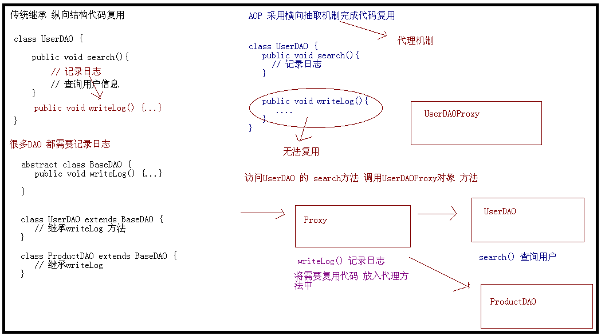
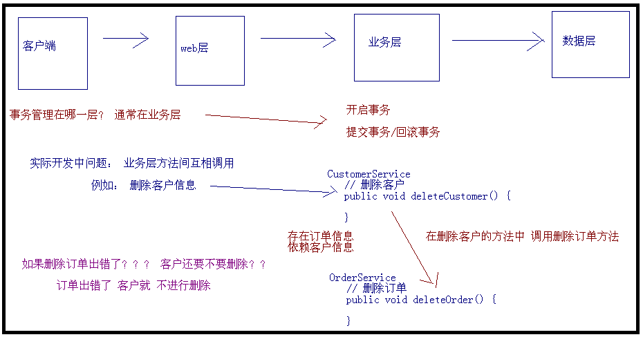

###1.什么是Spring?
Spring是一个容器框架，用来装javabean（java对象），中间层框架（万能胶）可以起一个连接作用，比如说把Struts和hibernate粘合在一起运用。简单来说，**Spring是一个轻量级的控制反转(IoC)和面向切面(AOP)的容器框架**。

###2.使用Spring的好处

####1. 轻量级框架 
Spring是轻量级框架,基本的版本大约2M
####2. 控制反转   
Spring通过控制反转实现松散耦合,对象们给它们的依赖,而不是创建或者查找依赖的对象们,方便解耦,简化开发
####3. 面相切面的编程 AOP
Spring支持面相切面的编程,并且把应用业务逻辑和系统分开
####4. 容器 
Spring 包含并管理应用中对象的生命周期和配置
####5. MVC框架 
Spring的WEB框架是个精心设计的框架,是WEB框架的一个很好的替代品
####6. 事务管理 
Spring 提供一个持续的事务管理接口,可以扩展到上至本地事务下至全局事务(JTA)
####7. 异常处理 
Spring 提供方便的API把具体技术的相关异常(比如由JDBC Hibernate or JDO 抛出的) 转化为一致的 unchecked异常

###IOC控制反转
说的是创建对象实例的控制权从代码控制剥离到IOC容器控制，实际就是你在xml文件控制，侧重于原理。

###DI依赖注入
说的是创建对象实例时，为这个对象注入属性值或其他对象实例后，侧重于实现。

###IoC 和 DI的区别？
IoC 控制反转，指将对象的创建权，反转到Spring容器 ， DI 依赖注入，指Spring创建对象的过程中，将对象依赖属性通过配置进行注入。

###Context
####ClassPathXmlApplicationContext
ClassPathXmlApplicationContext 默认会去 **classPath 路径**下找。classPath 路径指的就是编译后的 classes 目录。
```
//单配置文件方式一
BeanFactory beanFactory=new ClassPathXmlApplicationContext("application.xml");

//单配置文件方式二
BeanFactory beanFactory=new ClassPathXmlApplicationContext("classpath:application.xml");

//多个配置文件
BeanFactory beanFactory=new ClassPathXmlApplicationContext(new String[]{"application.xml"});

//绝对路径需加“file:”前缀
BeanFactory beanFactory = new ClassPathXmlApplicationContext("file:D:\work\springtest\src\main\resources\application.xml");
```
“classpath:” 是可以缺省的。\
**如果是绝对路径，必须加上 “file:” 前缀，不可缺省。**

####FileSystemXmlApplicationContext
FileSystemXmlApplicationContext 默认是去**项目的路径**下加载，可以是相对路径，也可以是绝对路径，若是绝对路径，**“file:” 前缀可以缺省**。

```
//classes目录
BeanFactory beanFactory=new FileSystemXmlApplicationContext("classpath:application.xml");

//项目路径相对路径
BeanFactory beanFactory=new FileSystemXmlApplicationContext("src\main\resources\application.xml");

//多配置文件
BeanFactory beanFactory=new FileSystemXmlApplicationContext(new String[]{"src\main\resources\application.xml"});

//绝对目录
BeanFactory beanFactory=new FileSystemXmlApplicationContext(new String[]{"D:\work\springtest\src\main\resources\application.xml"});
```

####BeanFactory和ApplicationContext有什么区别

- 相同点\
上述两者都是通过加载XMl配置文件的方式加载Bean,而后者是前者的扩展,提供了更多的功能,即**ApplicationContext拥有BeanFactory的全部功能**,在绝大多数的"典型的"企业应用和系统,ApplicationContext都优先于BeanFactory.

- 不同点\
**BeanFactory是延迟加载**,如果一个Bean当中存在属性没有加载,会在第一次调用getBean()方法的时候报错,而ApplicationContext会在读取Xml文件后,如果配置文件没有错误,就会将所有的Bean加载到内存中,缺点就是在Bean较多的时候比较占内存,程序启动较慢.

ApplicationContext的功能：
- 提供了支持国际化的文本消息
- 统一的资源文件读取方式
- 已在监听器中注册的bean的事件

####Bean的生命周期活动
    
    1.Bean的建立， 由BeanFactory读取Bean定义文件，并生成各个实例
    2.Setter注入，执行Bean的属性依赖注入
    3.BeanNameAware的setBeanName(), 如果实现该接口，则执行其setBeanName方法
    4.BeanFactoryAware的setBeanFactory()，如果实现该接口，则执行其setBeanFactory方法
    5.BeanPostProcessor的processBeforeInitialization()，如果有关联的processor，则在Bean初始化之前都会执行这个实例的processBeforeInitialization()方法
    6.InitializingBean的afterPropertiesSet()，如果实现了该接口，则执行其afterPropertiesSet()方法
    7.Bean定义文件中定义init-method
    8.BeanPostProcessors的processAfterInitialization()，如果有关联的processor，则在Bean初始化之前都会执行这个实例的processAfterInitialization()方法
    9.DisposableBean的destroy()，在容器关闭时，如果Bean类实现了该接口，则执行它的destroy()方法
    10.Bean定义文件中定义destroy-method，在容器关闭时，可以在Bean定义文件中使用“destory-method”定义的方法


###什么是AOP，AOP的作用是什么？

AOP利用一种称为“横切”的技术，剖解开封装的对象内部，并将那些影响了多个类的公共行为封装到一个可重用模块，并将其名为 “Aspect”，即方面。所谓“方面”，简单地说，就是将那些与业务无关，却为业务模块所共同调用的逻辑或责任封装起来，便于减少系统的重复代码，降低 模块间的耦合度，并有利于未来的可操作性和可维护性。\
**AOP把软件系统分为两个部分：核心关注点和横切关注点。**
业务处理的主要流程是核心关注点，与之关系不大的部分是横切关注点。\
横切关注点的一个特点是，他们经常发生在核心关注点的多处，而各处都基本相似。比如权限认证、日志、事务处理。\
**Aop 的作用在于分离系统中的各种关注点，将核心关注点和横切关注点分离开来。**

实现AOP的技术，主要分为两大类：\
**一是采用动态代理技术**，利用截取消息的方式，对该消息进行装饰，以取代原有对象行为的执行；\
**二是采用静态织入的方式**，引入特定的语法创建“方面”，从而使得编译器可以在编译期间织入有关“方面”的代码。然而殊途同归，实现AOP的技术特性却是相同的，分别为：

1、`join point`（连接点）：程序执行的某个特定位置（如：某个方法调用前、调用后，方法抛出异常后）。它是一个抽象的概念，在实现AOP时，并不需要去定义一个join point。\
2、`point cut`（切入点）：本质上是一个捕获连接点的结构。在AOP中，可以定义一个point cut，来捕获相关方法的调用。一个切点可以匹配多个连接点。\
3、`advice（通知）`：是point cut的执行代码，是执行“方面”的具体逻辑。\
4、`aspect（方面）`：point cut和advice结合起来就是aspect，它类似于OOP中定义的一个类，但它代表的更多是对象间横向的关系。\
5、`introduce（引入）`：为对象引入附加的方法或属性，从而达到修改对象结构的目的。

在AOP中，我们将这些具有公共逻辑的，与其他模块的核心逻辑纠缠在一起的行为称为“横切关注点（Crosscutting Concern）”，因为它跨越了给定编程模型中的典型职责界限。




###AOP通知有哪些类型？
- 前置通知（Before advice）：在某连接点（join point）之前执行的通知，但这个通知不能阻止连接点前的执行（除非它抛出一个异常）。
- 返回后通知（After returning advice）：在某连接点（join point）正常完成后执行的通知：例如，一个方法没有抛出任何异常，正常返回。 
- 抛出异常后通知（After throwing advice）：在方法抛出异常退出时执行的通知。 
- 后通知（After (finally) advice）：当某连接点退出的时候执行的通知（不论是正常返回还是异常退出）。 
- 环绕通知（Around Advice）：包围一个连接点（join point）的通知，如方法调用。这是最强大的一种通知类型。 环绕通知可以在方法调用前后完成自定义的行为。它也会选择是否继续执行连接点或直接返回它们自己的返回值或抛出异常来结束执行。 


###Spring如何处理线程并发问题？
Spring 的绝大多数Bean都是singleton的（非线程安全的），springmvc的controller也是是singleton的，以springmvc为例，
每个request过来，系统都会用原有的instance去处理，这样导致了两个结果:一是我们不用每次创建Controller，
二是减少了对象创建和垃圾收集的时间;由于只有一个Controller的instance，当多个线程调用它的时候，它里面的instance变量就不是线程安全的了，
会发生窜数据的问题。当然大多数情况下，我们根本不需要考虑线程安全的问题，比如dao,service等，除非在bean中声明了实例变量。
因此，我们在使用spring mvc 的contrller时，应避免在controller中定义实例变量。
                                                                               
有几种解决方法：\
1、在Controller中使用ThreadLocal变量\
2、在spring配置文件Controller中声明 scope="prototype"，每次都创建新的controller
所在在使用spring开发web 时要注意，默认Controller、Dao、Service都是单例的。

ThreadLocal 使用范例：
```
ThreadLocal<Long> startTime = newThreadLocal<Long>();//定义一个ThreadLocal 变量
startTime.set(System.currentTimeMillis());//写入值
startTime.get();//读取值
```
###为什么要有事物传播行为？


###SpringMVC的工作流程？


流程\
1、用户发送请求至前端控制器DispatcherServlet\
2、DispatcherServlet收到请求调用HandlerMapping处理器映射器\
3、处理器映射器找到具体的处理器，生成处理器对象及处理器拦截器(如果有则生成)一并返回给DispatcherServlet。 \
4、DispatcherServlet调用HandlerAdapter处理器适配器\
5、HandlerAdapter经过适配调用具体的处理器(Controller，也叫后端控制器)。\
6、Controller执行完成返回ModelAndView\
7、HandlerAdapter将controller执行结果ModelAndView返回给DispatcherServlet\
8、DispatcherServlet将ModelAndView传给ViewReslover视图解析器\
9、ViewReslover解析后返回具体View\
10、DispatcherServlet根据View进行渲染视图（即将模型数据填充至视图中）。\
11、DispatcherServlet响应用户

###Spring、SpringMVC和Springboot的区别
1. spring是一个一站式的轻量级的java开发框架，核心是控制反转（IOC）和面向切面（AOP），针对于开发的WEB层(springMvc)、业务层(Ioc)、持久层(jdbcTemplate)等都提供了多种配置解决方案；
2. springMvc是spring基础之上的一个MVC框架，主要处理web开发的路径映射和视图渲染，属于spring框架中WEB层开发的一部分；
3. spring boot使用了默认大于配置的理念，集成了快速开发的spring多个插件，同时自动过滤不需要配置的多余的插件，简化了项目的开发配置流程，一定程度上取消xml配置，是一套快速配置开发的脚手架，能快速开发单个微服务；
4. spring cloud大部分的功能插件都是基于springBoot去实现的，springCloud关注于全局的微服务整合和管理，将多个springBoot单体微服务进行整合以及管理；  springCloud依赖于springBoot开发，而springBoot可以独立开发；


