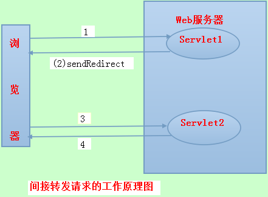

- [链接](https://www.cnblogs.com/lixuwu/p/7967946.html)

forward和redirect的英文含义：
>forward: 向前\
redirect: 重定向

### 异同
#### 1.从地址栏显示来说
- forward是服务器请求资源,服务器直接访问目标地址的URL,把那个URL的响应内容读取过来,然后把这些内容再发给浏览器.浏览器根本不知道服务器发送的内容从哪里来的,所以它的**地址栏还是原来的地址**.
- redirect是服务端根据逻辑,发送一个状态码(通常是302临时重定向),告诉浏览器重新去请求那个地址.所以**地址栏显示的是新的URL**.

#### 2.从数据共享来说
- forward:转发页面和转发到的页面可以共享request里面的数据.
- redirect:不能共享数据.

#### 3.从运用地方来说
- forward:一般用于用户登陆的时候,根据角色转发到相应的模块.
- redirect一般用于用户注销登陆时返回主页面和跳转到其它的网站等.

#### 4.从效率来说
- forward:高.
- redirect:低.

### 本质区别
#### 解释
Forward和Redirect代表了两种请求转发方式：直接转发和间接转发。
- 直接转发方式（Forward），服务器端行为。客户端和浏览器只发出一次请求，Servlet、HTML、JSP或其它信息资源，由第二个信息资源响应该请求，在请求对象request中，保存的对象对于每个信息资源是共享的。
- 间接转发方式（Redirect），客户端行为。实际是两次HTTP请求，服务器端在响应第一次请求的时候，让浏览器再向另外一个URL发出请求，从而达到转发的目的。

举个通俗的例子：
- 直接转发就相当于：“A找B借钱，B说没有，B去找C借，借到借不到都会把消息传递给A”；
- 间接转发就相当于："A找B借钱，B说没有，让A去找C借"。

下面详细阐述一下两者的原理：
#### 直接请求转发(Forward)
直接转发方式用的更多一些，一般说的请求转发指的就是直接转发方式。\
Web应用程序大多会有一个控制器，由控制器来控制请求应该转发给那个信息资源。然后由这些信息资源处理请求，处理完以后还可能转发给另外的信息资源来返回给用户，这个过程就是经典的MVC模式。\
javax.serlvet.RequestDispatcher接口是请求转发器必须实现的接口，由Web容器为Servlet提供实现该接口的对象，通过调用该接口的forward()方法到达请求转发的目的，示例代码如下：

```java
//Servlet里处理get请求的方法
public void doGet(HttpServletRequest request , HttpServletResponse response){
    //获取请求转发器对象，该转发器的指向通过getRequestDisPatcher()的参数设置
    RequestDispatcher requestDispatcher =request.getRequestDispatcher("资源的URL");
    //调用forward()方法，转发请求      
    requestDispatcher.forward(request,response);
}
```


上图所示的直接转发请求的过程如下：
1. 浏览器向Servlet1发出访问请求；
2. Servlet1调用forward()方法，在服务器端将请求转发给Servlet2；
3. 最终由Servlet2做出响应。

技巧：其实，通过浏览器就可以观察到服务器端使用了那种请求转发方式，当单击某一个超链接时，浏览器的地址栏会出现当前请求的地址，如果服务器端响应完成以后，发现地址栏的地址变了，则证明是间接的请求转发。相反，如果地址没有发生变化，则代表的是直接请求转发或者没有转发。

#### 间接请求转发(Redirect)
间接转发方式，有时也叫重定向，它一般用于避免用户的非正常访问。例如：用户在没有登录的情况下访问后台资源，Servlet可以将该HTTP请求重定向到登录页面，让用户登录以后再访问。在Servlet中，通过调用response对象的SendRedirect()方法，告诉浏览器重定向访问指定的URL，示例代码如下：
```java
//Servlet中处理get请求的方法
public void doGet(HttpServletRequest request,HttpServletResponse response){
    //请求重定向到另外的资源
    response.sendRedirect("资源的URL");
}
```


上图所示的间接转发请求的过程如下：
1. 浏览器向Servlet1发出访问请求；
2. Servlet1调用sendRedirect()方法，将浏览器重定向到Servlet2；
3. 浏览器向servlet2发出请求；
4. 最终由Servlet2做出响应。 

**问：直接转发和间接转发的原理及区别是什么？**\
答：Forward和Redirect代表了两种请求转发方式：直接转发和间接转发。对应到代码里，分别是RequestDispatcher类的forward()方法和HttpServletRequest类的sendRedirect()方法。——服务端转发  客户端转发\
对于间接方式，服务器端在响应第一次请求的时候，让浏览器再向另外一个URL发出请求，从而达到转发的目的。它本质上是两次HTTP请求，对应两个request对象。\
对于直接方式，客户端浏览器只发出一次请求，Servlet把请求转发给Servlet、HTML、JSP或其它信息资源，由第2个信息资源响应该请求，两个信息资源共享同一个request对象。

##### forward过程
转发，服务器端行为。web服务器把接受的请求，调用内部的方法在容器内部完成请求处理和转发动作，然后响应客户端，在这里，**转发的路径必须是同一个web容器下的url，其不能转向到其他的web路径上去，中间传递的是自己的容器内的request**。

##### redirect过程
重定向，客户端行为。客户端发送http请求，web服务器接受后发送302状态码响应及对应新的location给客客户端，客户端发现是302响应，则自动再发送一个新的http请求，请求url是新的location地址，在这里location可以重定向到任意URL，既然是浏览器重新发出了请求，则就没有什么request传递的概念了。重定向行为是浏览器做了至少两次的访问请求的。


