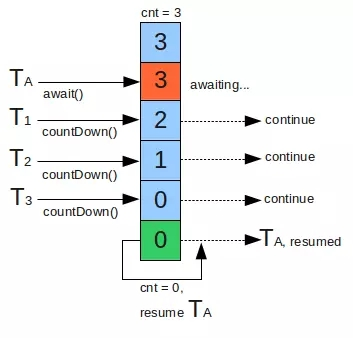
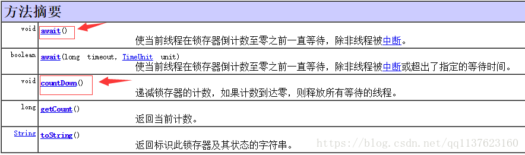

- [链接](https://blog.csdn.net/vernonzheng/article/details/8280032)
- [链接](https://www.cnblogs.com/dolphin0520/p/3920397.html)
- [链接](https://www.cnblogs.com/yiqiu2324/p/3243828.html)

同步工具类可以是任何一个对象，只要它根据其自身的状态来协调线程的控制流。\
阻塞队列可以作为同步工具类，其他类型的同步工具类还包括信号量（Semaphore）、栅栏（Barrier）以及闭锁（Latch）。

- Semaphore           ：一个计数信号量
- CountDownLatch      ：一个同步辅助类，在完成一组正在其他线程中执行的操作之前，它允许一个或多个线程一直等待。 
- CyclicBarrier       ：一个同步辅助类，它允许一组线程互相等待，直到到达某个公共屏障点 
- Exchanger           ：方便了两个共同操作线程之间的双向交换

### 1.CountDownLatch
CountDownLatch是一个同步工具类，它允许一个或多个线程一直等待，直到其他线程执行完后再执行。\
例如，应用程序的主线程希望在负责启动框架服务的线程已经启动所有框架服务之后执行。\
应用初始化过程极其重要，它是应用后续平稳运行的前提和保证。开发初始化配置模块，更好地管理初始化逻辑，对初始化地工作进行分层，分优先级，多线程地规划，进而在大幅提升初始化效率，同时还有完整地日志监控体系功能。有了它，规划整个初始化工作将简单而优雅.

CountDownLatch 是通过一个计数器来实现的，计数器的初始化值为线程的数量。每当一个线程完成了自己的任务后，计数器的值就相应得减1。
当计数器到达0时，表示所有的线程都已完成任务，然后在闭锁上等待的线程就可以恢复执行任务。

闭锁可以用来确保某些活动直到其他活动都完成后才继续执行，例如：
- 确保某个计算在其需要的所有资源都被初始化之后才继续执行。
- 确保某个服务在其依赖的所有其他服务都已经启动之后才启动。
- 等到直到直到某个操作的所有参与者（例如，在多玩家游戏中的所有玩家）都就绪再继续执行。

CountDownLatch是一种灵活的闭锁实现。闭锁状态包括一个计数器，该计数器被初始化为一个正数，表示需要等待的事件数量。countDown方法递减计数器，表示有一个事件已经发生了，
而await方法等待计数器达到零，这表示所有需要等待的事件都已发生。如果计数器的值非零，那么await方法会一直阻塞直到计算器为零，或者等待中的线程中断，或者超时。

用给定的计数 初始化 CountDownLatch。由于调用了 countDown() 方法，所以在当前计数到达零之前，await 方法会一直受阻塞。之后，会释放所有等待的线程，await 的所有后续调用都将立即返回。这种现象只出现一次计数无法被重置。如果需要重置计数，请考虑使用 CyclicBarrier。

### 2.CycleBarrier
栅栏（Bariier）类似于闭锁，它能阻塞一组线程知道某个事件发生。栅栏与闭锁的关键区别在于，所有的线程必须同时到达栅栏位置，才能继续执行。闭锁用于等待等待时间，而栅栏用于等待线程。\
栅栏用于实现一些协议，例如几个家庭决定在某个地方集合：“所有人6：00在麦当劳碰头，到了以后要等其他人，之后再讨论下一步要做的事情”。

CyclicBarrier 可以使一定数量的参与方反复的在栅栏位置汇聚，它在并行迭代算法中非常有用：将一个问题拆成一系列相互独立的子问题。
当线程到达栅栏位置时，调用await() 方法，这个方法是阻塞方法，直到所有线程到达了栅栏位置，那么栅栏被打开，此时所有线程被释放，而栅栏将被重置以便下次使用。
如果对await的调用超时，或者await阻塞的线程被中断，那么栅栏就认为是打破了，所有阻塞的await调用都将终止并抛出BrokenBarrierException。
CycleBarrier还可以使你将一个栅栏操作传递给构造函数，这是一个Runnable，当成功通过栅栏会（在一个子任务线程中）执行它，但在阻塞线程被释放之前是不能执行的。

### 3.Semaphore
计数信号量（counting semaphore）用来控制同时访问某个特定资源的操作数量，或者同时执行某个制定操作的数量。计数信号量还可以实现某种资源池，或者对容器施加边界。

Semaphore中管理着一组虚拟的许可（permit），许可的初始数量可通过构造函数来指定。在执行操作时可以首先获得许可（只要还有剩余的许可），并在使用以后释放许可。\
如果没有许可，那么acquire将阻塞直到有许可（或者直到被中断或者操作超时）。release方法将返回一个许可给信号量。计算信号量的一种简化形式是二值信号量，即初始值为1的Semaphore。\
二值信号量可以用作互斥体（mutex），并具备不可重入的加锁语义：谁拥有这个唯一的许可，谁就拥有可互斥锁。

Semaphore可以用于实现资源池，例如数据库连接池。我们可以构造一个固定长度的资源池，当池为空时，请求资源将会失败，但你真正希望看到的行为是阻塞而不是失败，并且当池非空时解除阻塞。\
如果将Semaphore的计数值初始化为池的大小，并在从池中获取一个资源之前首先调用acquire方法获取一个许可，在将资源返回给池之后调用release释放许可，那么acquire将一直阻塞直到资源池不为空。

### 4.Exchanger

可以在对中对元素进行配对和交换的线程的同步点。每个线程将条目上的某个方法呈现给 exchange 方法，与伙伴线程进行匹配，并且在返回时接收其伙伴的对象。Exchanger 可能被视为 SynchronousQueue 的双向形式。Exchanger 可能在应用程序（比如遗传算法和管道设计）中很有用。

