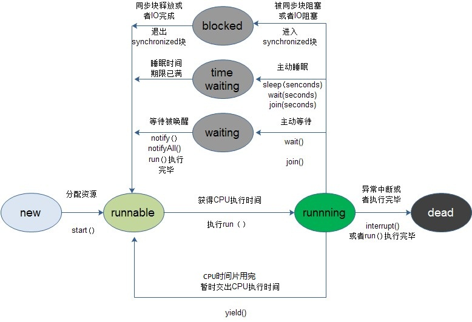

- [参考](https://www.jianshu.com/p/fa6667dfb4ca)
- [CODE](/多线程和并发/mt/sync/Sync1.java)
<a href="https://www.jianshu.com/p/fa6667dfb4ca" target="_blank">参考</a>

### 1.sleep()方法
sleep()是Thread的静态方法。\
**让线程进入阻塞状态，不会释放锁。**\
让当前正在执行的线程暂停执行，交出CPU，让CPU去执行其他的任务。`不推荐使用`\
sleep()使当前线程进入阻塞状态，在指定时间内不会执行。\
使当前线程（即调用该方法的线程）暂停执行一段时间，让其他线程有机会继续执行，但它并不释放对象锁。也就是说如果有synchronized同步快，其他线程仍然不能访问共享数据。注意该方法要捕捉异常。\
例如有两个线程同时执行(没有synchronized)一个线程优先级为MAX_PRIORITY【10】，另一个为MIN_PRIORITY【1】，如果没有Sleep()方法，只有高优先级的线程执行完毕后，低优先级的线程才能够执行；但是高优先级的线程sleep(500)后，低优先级就有机会执行了。\
总之，sleep()可以使低优先级的线程得到执行的机会，当然也可以让同优先级、高优先级的线程有执行的机会。

### 2.wait()方法
**让当前对象的线程从“运行状态”进入“阻塞状态”，并释放锁对象。**\
在其他线程调用对象的notify或notifyAll方法前，导致当前线程等待。**线程会释放掉它所占有的“锁标志”**，从而使别的线程有机会抢占该锁。\
让当前线程进入阻塞等待状态，同时让当前线程释放它所持有的锁。让其他线程可以进入synchronized数据块，当前线程被放入对象等待池中。
当前线程必须拥有当前对象锁。如果当前线程不是此锁的拥有者，会抛出IllegalMonitorStateException异常。\
唤醒当前对象锁的等待线程使用notify或notifyAll方法，也必须拥有相同的对象锁，否则也会抛出IllegalMonitorStateException异常。\
waite()和notify()必须在synchronized函数或synchronized　block中进行调用。如果在non-synchronized函数或non-synchronized　block中进行调用，虽然能编译通过，但在运行时会发生IllegalMonitorStateException的异常。

### 3.yield()方法
暂停当前正在执行的线程对象。\
**让线程进入到“就绪状态”，不会释放锁。**
yield()只是使当前线程重新回到可执行状态，所以执行yield()的线程有可能在进入到可执行状态后马上又被执行。\
yield()只能使同优先级或更高优先级的线程有执行的机会。\
调用yield方法并不会让线程进入阻塞状态，而是让线程重回就绪状态，它只需要等待重新获取CPU执行时间，这一点是和sleep方法不一样的。

### 4.join()方法
等待该线程终止。\
**进入阻塞状态，并且会释放线程占有的锁，并交出CPU执行权限。**\
join()方法优先执行调用该方法的线程，再执行当前线程。也就是等待该方法的调用线程执行完毕后才往下继续执行。\
在很多情况下，主线程创建并启动了线程，如果子线程中药进行大量耗时运算，主线程往往将早于子线程结束之前结束。这时，如果主线程想等待子线程执行完成之后再结束，比如子线程处理一个数据，主线程要取得这个数据中的值，就要用到join()方法了。方法join()的作用是等待线程对象销毁。\
看join()方法源码可知：实际上调用join方法就是调用了Object的wait方法。

### 5.notify()方法
必须在synchronized语句块内使用。\
**在同步锁中，让当前对象从阻塞状态转变为就绪状态。**\
notify()：唤醒当前对象上的一个等待线程，当调用notify()方法后，将从对象的等待池中移走一个任意的线程并放到锁标志等待池中，只有锁标志等待池中线程能够获取锁标志；如果锁标志等待池中没有线程，则notify()不起作用。\
notifyAll()：唤醒当前对象上的所有等待线程，从对象等待池中移走所有等待那个对象的线程并放到锁标志等待池中。

### 6.区别
- sleep(): **让线程进入到“阻塞状态”，不会释放锁。** 给其他线程运行机会时不考虑线程的优先级，因此会给低优先级的线程以运行的机会；\
- wait(): **让线程从“运行状态”进入“阻塞状态”，并释放锁。**
- yield(): **让线程进入到“就绪状态”，不会释放锁。** 只会给相同优先级或更高优先级的线程以运行的机会；\
- join(): **让线程进入到“阻塞状态”，并且会释放线程占有的锁，并交出CPU执行权限。** join的意思是会等到调用该join方法的线程执行完毕之后才会执行其他线程。

#### 6.1、wait()和sleep()的区别：
- **wait()方法定义在Object类下**，**必须用在synchronized代码中**，否则会报IllegalMonitorStateException异常，而**sleep()方法定义在Thread类下**，没什么限制条件；
- **wait()方法作用在Object对象上， 而sleep()方法作用在Thread对象上**；
- **wait()方法释放同步锁，sleep()方法不释放锁**；
- wait()需要定义在循环里(一般是while循环)，防止线程唤醒后，唤醒条件再一次不满足，而sleep()尽量不要放在循环中调用。

#### 6.2、wait()和notify()、notifyAll()：
这三个方法用于协调多个线程对共享数据的存取，所以必须在synchronized语句块内使用。\
synchronized关键字用于保护共享数据，阻止其他线程对共享数据的存取，但是这样程序的流程就很不灵活了，如何才能在当前线程还没退出synchronized数据块时让其他线程也有机会访问共享数据呢？此时就用这三个方法来灵活控制。\
注意 这三个方法都是java.lang.Object的方法。

#### 6.3、wait和yield（或sleep）的区别：
- wait()是让线程由“运行状态”进入到“阻塞状态”，而yield()是让线程由“运行状态”进入到“就绪状态”，从而让其它具有相同优先级的等待线程获取执行权；但是，并不能保证在当前线程调用yield()之后，其它具有相同优先级的线程就一定能获得执行权。
- wait()是会线程释放它所持有对象的同步锁，而yield()方法不会释放锁。

Thread的方法: sleep(static)、yield(static)、join(非static);\
Object对象的方法: wait、notify、notifyAll;

不释放锁的方法: sleep、yield;\
释放锁的方法: wait、join;

