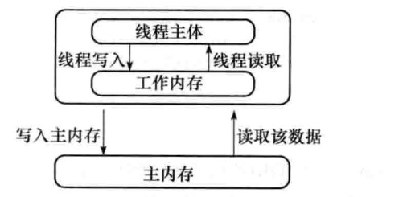
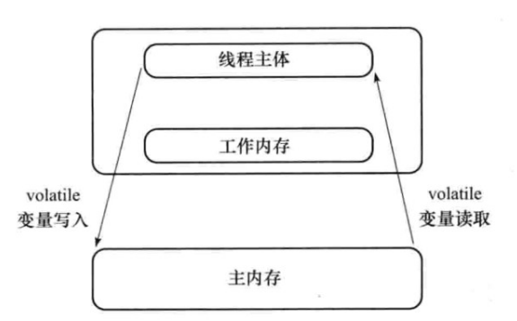
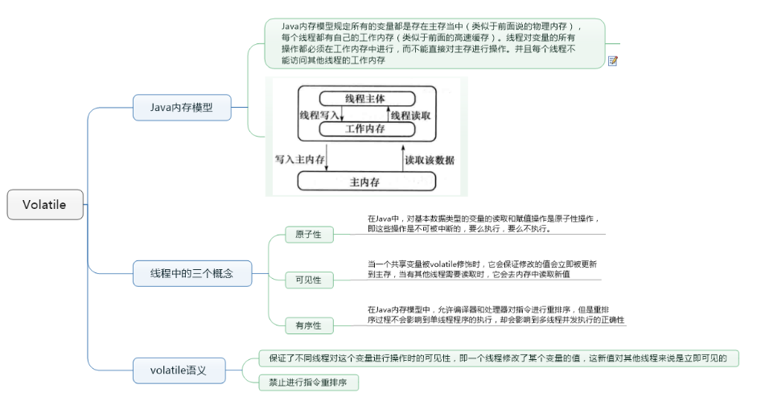

volatile，从字面上说是易变的、不稳定的，这个关键字的作用就是告诉编译器，只要是被此关键字修饰的变量都是易变的、不稳定的。那为什么是易变的呢？因为volatile所修饰的变量是直接存在于主内存中的，线程对变量的操作也是直接反映在主内存中，所以说其是易变的。

### 一、Java内存模型
Java内存模型规定所有的变量都是存在主存当中（类似于物理内存），每个线程都有自己的工作内存（类似于高速缓存）。线程对变量的所有操作都必须在工作内存中进行，而不能直接对主存进行操作。并且每个线程不能访问其他线程的工作内存。如下图：

```java
public class VolatileExample extends Thread{
    //设置类静态变量,各线程访问这同一共享变量
    private  static boolean flag = false;
    //无限循环,等待flag变为true时才跳出循环
   public void run() {
       while (!flag){
       }
       System.out.println("停止了");
   }

    public static void main(String[] args) throws Exception {
        new VolatileExample().start();
        //sleep的目的是等待线程启动完毕,也就是说进入run的无限循环体了
        Thread.sleep(100);
        flag = true;
    }
}
```
我执行后发现上面的程序一直在while循环，不会打印“停止了”这条信息，为什么呢？不是有设置flag=true吗？\
下面解释一下这段代码为何有可能导致无法中断线程。在前面已经解释过，每个线程在运行过程中都有自己的工作内存，那么线程VolatileExample在运行的时候，会将flag变量的值拷贝一份放在自己的工作内存当中。
那么当线程main更改了flag变量的值之后，但是还没来得及写入主存当中，线程main转去做其他事情了，那么线程VolatileExample由于不知道线程main对flag变量的更改，因此还会一直循环下去。

### 二、线程中的三个概念

#### 1.原子性
**在Java中，对基本数据类型的变量的读取和赋值操作是原子性操作，即这些操作是不可被中断的，要么执行，要么不执行。**

请分析以下哪些操作是原子性操作：
```java
x = 10;         //语句1
y = x;         //语句2
x++;           //语句3
x = x + 1;     //语句4
```
咋一看，有些朋友可能会说上面的4个语句中的操作都是原子性操作。其实只有语句1是原子性操作，其他三个语句都不是原子性操作。\
语句1是直接将数值10赋值给x，也就是说线程执行这个语句的会直接将数值10写入到工作内存中。\
语句2实际上包含2个操作，它先要去读取x的值，再将x的值写入工作内存，虽然读取x的值以及 将x的值写入工作内存 这2个操作都是原子性操作，但是合起来就不是原子性操作了。\
同样的，x++和 x = x+1包括3个操作：读取x的值，进行加1操作，写入新的值。  所以上面4个语句只有语句1的操作具备原子性。\
也就是说，只有简单的读取、赋值（而且必须是将数字赋值给某个变量，变量之间的相互赋值不是原子操作）才是原子操作。\
不过这里有一点需要注意：在32位平台下，对64位数据的读取和赋值是需要通过两个操作来完成的，不能保证其原子性。但是好像在最新的JDK中，JVM已经保证对64位数据的读取和赋值也是原子性操作了。  
从上面可以看出，Java内存模型只保证了基本读取和赋值是原子性操作，如果要实现更大范围操作的原子性，可以通过synchronized和Lock来实现。由于synchronized和Lock能够保证任一时刻只有一个线程执行该代码块，那么自然就不存在原子性问题了，从而保证了原子性。

#### 2.可见性
对于可见性，Java提供了volatile关键字来保证可见性。\
当一个共享变量被volatile修饰时，它会保证修改的值会立即被更新到主存，当有其他线程需要读取时，它会去内存中读取新值。\
而普通的共享变量不能保证可见性，因为普通共享变量被修改之后，什么时候被写入主存是不确定的，当其他线程去读取时，此时内存中可能还是原来的旧值，因此无法保证可见性。\
另外，通过synchronized和Lock也能够保证可见性，synchronized和Lock能保证同一时刻只有一个线程获取锁然后执行同步代码，并且在释放锁之前会将对变量的修改刷新到主存当中。因此可以保证可见性。

#### 3.有序性
在Java内存模型中，允许编译器和处理器对指令进行重排序，但是重排序过程不会影响到单线程程序的执行，却会影响到多线程并发执行的正确性。\
在Java里面，可以通过volatile关键字来保证一定的“有序性”。另外可以通过synchronized和Lock来保证有序性，很显然，synchronized和Lock保证每个时刻是有一个线程执行同步代码，相当于是让线程顺序执行同步代码，自然就保证了有序性。\
另外，Java内存模型具备一些先天的“有序性”，即不需要通过任何手段就能够得到保证的有序性，这个通常也称为 happens-before 原则。如果两个操作的执行次序无法从happens-before原则推导出来，那么它们就不能保证它们的有序性，虚拟机可以随意地对它们进行重排序。

下面就来具体介绍下happens-before原则（先行发生原则）：
1. 程序次序规则：一个线程内，按照代码顺序，书写在前面的操作先行发生于书写在后面的操作
1. 锁定规则：一个unLock操作先行发生于后面对同一个锁的lock操作
1. volatile变量规则：对一个变量的写操作先行发生于后面对这个变量的读操作
1. 传递规则：如果操作A先行发生于操作B，而操作B又先行发生于操作C，则可以得出操作A先行发生于操作C
1. 线程启动规则：Thread对象的start()方法先行发生于此线程的每个一个动作
1. 线程中断规则：对线程interrupt()方法的调用先行发生于被中断线程的代码检测到中断事件的发生
1. 线程终结规则：线程中所有的操作都先行发生于线程的终止检测，我们可以通过Thread.join()方法结束、Thread.isAlive()的返回值手段检测到线程已经终止执行
1. 对象终结规则：一个对象的初始化完成先行发生于他的finalize()方法的开始

这8条规则中，前4条规则是比较重要的，后4条规则都是显而易见的。

下面我们来解释一下前4条规则：\
对于程序次序规则来说，我的理解就是一段程序代码的执行在单个线程中看起来是有序的。注意，虽然这条规则中提到“书写在前面的操作先行发生于书写在后面的操作”，这个应该是程序看起来执行的顺序是按照代码顺序执行的，因为虚拟机可能会对程序代码进行指令重排序。虽然进行重排序，但是最终执行的结果是与程序顺序执行的结果一致的，它只会对不存在数据依赖性的指令进行重排序。因此，在单个线程中，程序执行看起来是有序执行的，这一点要注意理解。事实上，这个规则是用来保证程序在单线程中执行结果的正确性，但无法保证程序在多线程中执行的正确性。\
第二条规则也比较容易理解，也就是说无论在单线程中还是多线程中，同一个锁如果出于被锁定的状态，那么必须先对锁进行了释放操作，后面才能继续进行lock操作。\
第三条规则是一条比较重要的规则，也是后文将要重点讲述的内容。直观地解释就是，如果一个线程先去写一个变量，然后一个线程去进行读取，那么写入操作肯定会先行发生于读操作。\
第四条规则实际上就是体现happens-before原则具备传递性。

volatile关键字禁止指令重排序有两层意思：
- 1）当程序执行到volatile变量的读操作或者写操作时，在其前面的操作的更改肯定全部已经进行，且结果已经对后面的操作可见；在其后面的操作肯定还没有进行；
- 2）在进行指令优化时，不能将在对volatile变量访问的语句放在其后面执行，也不能把volatile变量后面的语句放到其前面执行。

### 三、volatile语义
一旦一个共享变量（类的成员变量、类的静态成员变量）被volatile修饰之后，那么就具备了两层语义：
- 保证了不同线程对这个变量进行操作时的可见性，即一个线程修改了某个变量的值，这新值对其他线程来说是立即可见的。
- 禁止进行指令重排序。

所以当把上面代码中变量flag改成下面这样：
>private  static valotile boolean flag = false;

在执行的话，你就会发现打印了“停止了”信息，因为用volatile修饰之后就变得不一样了：\
第一：使用volatile关键字会强制将修改的值立即写入主存；\
第二：使用volatile关键字的话，当线程main进行修改时，会导致线程那么线程VolatileExample的工作内存中缓存变量flag的缓存行无效（反映到硬件层的话，就是CPU的L1或者L2缓存中对应的缓存行无效）；\
第三：由于线程那么线程VolatileExample的工作内存中缓存变量flag的缓存行无效，所以线程那么线程VolatileExample再次读取变量flag的值时会去主存读取。\
那么在线程main修改flag值时（当然这里包括2个操作，修改线程main工作内存中的值，然后将修改后的值写入内存），会使得线程VolatileExample的工作内存中缓存变量flag的缓存行无效，然后线程读取时，发现自己的缓存行无效，它会等待缓存行对应的主存地址被更新之后，然后去对应的主存读取最新的值。
那么线程VolatileExample读取到的就是最新的正确的值。


使用volatile关键字增加了实例变量在多个线程之间的可见性。但是**volatile关键字最致命的缺点是不支持原子性**。
下面将关键字synchronized和volatile进行一下比较：
- 1）关键字volatile是线程同步的轻量级实现，所以volatile性能肯定比synchronized要好，并且volatile只能修饰于变量，而synchronized可以修饰方法，以及代码块。随着JDK新版本的发布，synchronized关键字在执行效率上得到很大提升，在开发中使用synchronized关键字的比率还是比较大的。
- 2）多线程访问volatile不会发生阻塞，而synchronized会出现阻塞。
- 3）volatile能保证数据的可见性，但不能保证原子性；而synchronized可以保证原子性，也可以间接保证可见性，因为它将私有内存和公共内存中的数据做同步。
- 4）再次重申一下，关键字volatile解决的是变量在多个线程之间的可见性；而synchronized关键字解决的是多个线程之间访问资源的同步性。

### 四、volatile的原理和实现机制
>“观察加入volatile关键字和没有加入volatile关键字时所生成的汇编代码发现，加入volatile关键字时，会多出一个lock前缀指令”  --《深入理解Java虚拟机》

lock前缀指令实际上相当于一个内存屏障（也成内存栅栏），内存屏障会提供3个功能：
- 它确保指令重排序时不会把其后面的指令排到内存屏障之前的位置，也不会把前面的指令排到内存屏障的后面；即在执行到内存屏障这句指令时，在它前面的操作已经全部完成；
- 它会强制将对缓存的修改操作立即写入主存；
- 如果是写操作，它会导致其他CPU中对应的缓存行无效。

### 五、总结
synchronized关键字是防止多个线程同时执行一段代码，那么就会很影响程序执行效率，而volatile关键字在某些情况下性能要优于synchronized，但是要注意volatile关键字是无法替代synchronized关键字的，因为volatile关键字无法保证操作的原子性。\
通常来说，使用volatile必须具备以下2个条件：
- 对变量的写操作不依赖于当前值
- 该变量没有包含在具有其他变量的不变式中

实际上，这些条件表明，可以被写入 volatile 变量的这些有效值独立于任何程序的状态，包括变量的当前状态。\
设计模式中的单例模式中的双检查锁就使用到了volatile关键字。




